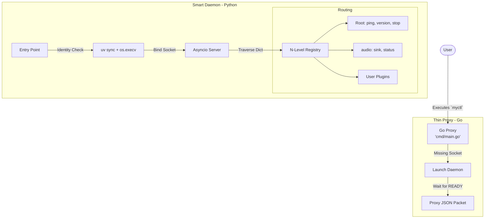

# AGENTS.md — MyCTL System Design & Developer Guide

## System Principles

-   **Always use `mise`** for toolchain management (Go, Python, Bun).
-   **Always use `uv`** for Python environment and dependency management.
-   **No Logic in Go**: The Go client is a pure $O(1)$ proxy.
-   **Self-Bootstrapping**: The Python daemon manages its own isolated environment (venv).

---

## 1. Project Overview

MyCTL is a high-performance Linux desktop controller built on a **Lean Client / Fat Server** architecture. It prioritizes sub-millisecond CLI responsiveness and deep system integration via a persistent Python daemon.

### Core Components
-   **`cmd/` (Thin Proxy)**: Go binary. A purely agnostic tunnel that forwards CLI arguments to the daemon via JSON-IPC.
-   **`daemon/` (Smart Server)**: Python 3.13+ namespaced package. Handles environment bootstrapping, N-level command routing, and native system integrations (PulseAudio, DBus).
-   **IPC**: Newline-delimited JSON over `$XDG_RUNTIME_DIR/myctl-daemon.sock`.

---

## 2. Updated Architecture (V2)

The Go client no longer parses commands or builds `cobra` trees. It blindly proxies `os.Args` to the Python registry.



---

## 3. The 5 Core Invariants

1.  **Proxy Mapping**: The Go client only intercepts `daemon start`. All other lifecycle mapping (e.g., `daemon stop` -> `stop`) is handled by a thin translation layer in `cmd/main.go`.
2.  **Ready-Signal Handshake**: No "blind waiting." The Go client blocks until the daemon prints `__DAEMON_READY__` to its stdout.
3.  **SDK First**: All code under `daemon/myctl/core` is internal. Plugins must only import from the **`myctl.api`** curated SDK.
4.  **XDG Compliance**: All persistent state (venv, logs, plugins) must live in XDG standard directories (`~/.local/share`, `~/.local/state`).
5.  **Namespaced Sandbox**: The daemon must run inside its own isolated `uv` environment, never polluting the system Python.

---

## 4. Directory Layout

```text
MyCTL/
├── bin/                 # Compiled executable (myctl)
├── cmd/                 # Go source (Flat Layout)
│   ├── main.go          # CLI Proxy
│   └── daemon.go        # Handshake & Bootstrapping
├── daemon/              # Python source
│   ├── myctl-daemon     # Entry point
│   ├── pyproject.toml   # SDK Definition
│   └── myctl/           # Namespaced Package
│       ├── api/         # Public SDK (Pro DX)
│       └── core/        # Internal Machinery
└── docs/                # Technical Documentation (VitePress)
    └── md/              # Documentation Source
```

---

## 5. Documentation Portal

For deep technical dives into the protocol, discovery mechanism, or bootstrapping lifecycle, consult the **MyCTL Developer Portal**:

-   [Architecture Overview](file:///home/soymadip/Projects/MyCTL/docs/md/architecture.md)
-   [Self-Bootstrapping Lifecycle](file:///home/soymadip/Projects/MyCTL/docs/md/bootstrapping.md)
-   [IPC Protocol Specification](file:///home/soymadip/Projects/MyCTL/docs/md/ipc-protocol.md)
-   [Plugin SDK Guide](file:///home/soymadip/Projects/MyCTL/docs/md/plugin-sdk.md)

---

## 6. Development Workflow

1.  **Bootstrap**: `mise install`
2.  **Build**: `mise run build` (Builds Go client + syncs daemon)
3.  **Trace**: `LOG_LEVEL=DEBUG ./daemon/myctl-daemon`
4.  **SDK Setup**: `myctl sdk setup` (Configures IDE for `myctl.api` autocompletion)
