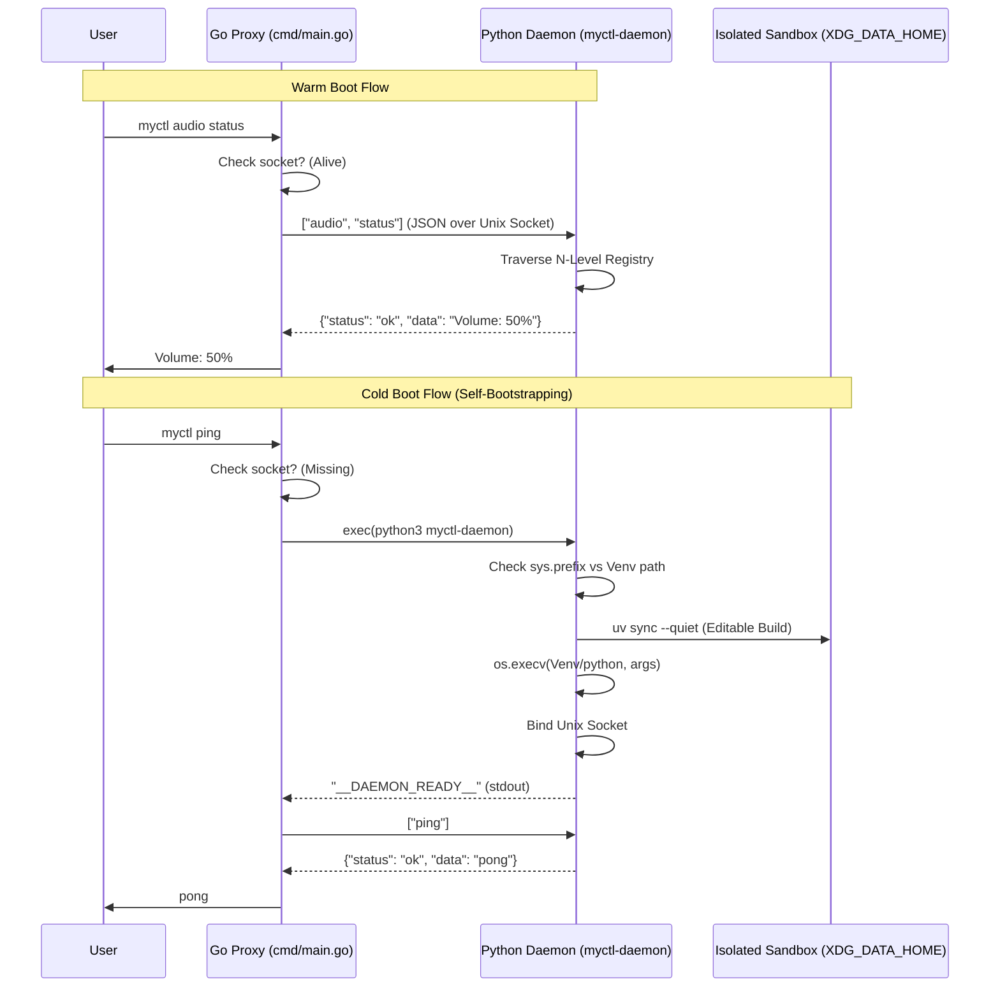

# System Architecture

MyCTL is built on a **Lean Client / Fat Server** architecture, optimized for speed, reliability, and modularity. By separating the fast Go CLI (the Proxy) from the heavy Python business logic (the Daemon), we achieve sub-millisecond command overhead while maintaining a rich, stateful environment for complex operations.

## Core Philosophy

1.  **Dumb Client**: The Go binary (`myctl`) is a minimal $O(1)$ proxy. It contains zero application logic and is responsible only for IPC tunneling and process bootstrapping.
2.  **Intelligent Server**: The Python Daemon (`myctl-daemon`) is self-bootstrapping and self-managing. it handles its own environment (venv), command discovery, and hierarchical routing.
3.  **Standardized Distribution**: Adheres to Linux FHS and XDG standards for system-wide, read-only installation compatibility.

## System Interaction Flow

The following sequence diagram illustrates the lifecycle of a command, highlighting the difference between a **Warm Boot** (daemon running) and a **Cold Boot** (self-bootstrapping).

## Linux Distribution Standards (FHS/XDG)

To ensure MyCTL can be distributed safely via package managers (like `apt`, `dnf`, or `pacman`), it adheres to strict pathing standards:

| Component | Path | Responsibility |
| :--- | :--- | :--- |
| **Binary** | `/usr/bin/myctl` | The global entry point. |
| **Data Root** | `/usr/share/myctl/daemon/` | Read-only Python source and SDK. |
| **Sandbox (Venv)** | `~/.local/share/myctl/venv` | Isolated execution environment. |
| **Plugins** | `~/.local/share/myctl/plugins` | User-installed extensions. |
| **Logs** | `~/.local/state/myctl/daemon.log` | Persistent daemon audit trail. |
| **Socket** | `$XDG_RUNTIME_DIR/myctl-daemon.sock` | Fast IPC communication. |

## Why "Pure Proxy"?

By removing `Cobra` and all dynamic parsing from the Go client, we eliminate the need to recompile the binary when adding new features. The Go client simply forwards `os.Args` to the Python daemon's internal registry, making the system infinitely extensible at runtime.
