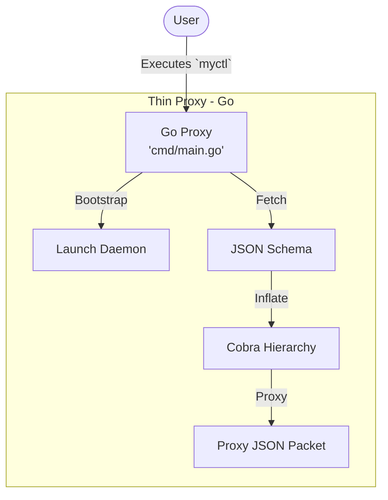

# Project Roadmap

This document serves as the **Standard Execution Task List** for MyCTL. Every architectural transition and feature rollout is tracked here to ensure 100% synchronization between the system design and implementation.

## 🏗 Phase 1: Python Daemon Foundation (Fat Server)

Establishing the high-performance core engine and self-bootstrapping logic.

- ✅ **Internal Switchboard**: `daemon/myctl/core/config.py` implemented with XDG resolution.
- ✅ **Pro-Grade Example**: `daemon/plugins/audio/` implemented with manifest-driven metadata.
- ✅ **Standardized IPC**: Implementing the Pydantic request/response schema in `core/ipc.py`.
- ✅ **Server Engine**: Implementing `daemon/myctl/core/app.py` (Asyncio Unix Socket Server).
- ✅ **Registry Engine**: Implementing `daemon/myctl/core/registry.py` (Implicit Plugin ID Router).
- ✅ **Self-Bootstrapper**: Finalizing `daemon/myctld` (Self-Bootstrapper & SDK Injector).

## 🚀 Phase 2: Go Proxy (Lean Client)

Refactoring the CLI client to achieve sub-millisecond $O(1)$ response times.

- ✅ **Logic Sanitization**: Stripping `cobra` from `cmd/main.go`.
- ✅ **Dumb Tunnel**: Implementing the blind JSON-IPC tunnel in the Go proxy.
- ✅ **Ready-Signal Handshake**: Blocking wait for the `__DAEMON_READY__` signal on cold boots.

## 📦 Phase 3: Functional Built-ins

Porting core system functionality to the new namespaced V2 architecture.

- ✅ **Built-ins**: Porting `ping` and `version` to the Core Engine level.
- ✅ **Audio Migration**: Finalizing the `audio` plugin with system-native integrations.

- ✅ **N-Level Architecture**: Infinite-depth recursive command hierarchy implemented in the Python registry.
- ✅ **Dynamic Cobra Proxy**: The Go client now rehydrates its Cobra tree from the daemon's schema at runtime.
- ✅ **Zero-Boilerplate SDK**: Bridged plugin decorators to the central engine via `myctl.api`.
- ✅ **Developer Portal**: Comprehensive technical documentation refactored for V2 (Architecture, IPC, SDK, Registry).

### Updated Architecture (V2.5)

The Go client is a **Dynamic Cobra Proxy** backed by **UV Orchestration**. It fetches the command schema from the daemon at runtime while leveraging `uv run` to ensure a deterministic Python environment without system dependencies.

## 🏗 Phase 5: Advanced Functional Extensions

Items in the strategic backlog for subsequent releases.

- ✅ **`on_load` Lifecycle Hook**: `@registry.on_load` for async plugin setup (hardware connection, DBus init).
- ✅ **Built-in Logger**: `from myctl.api import logger` — per-plugin scoped logger writing to daemon log file.
- ✅ **Manifest-Driven Group Help**: Sub-group descriptions declared in `[tool.myctl.groups]` in `pyproject.toml`, applied by the discovery engine.
- ✅ **Dependency Auto-Management**: `uv pip install <plugin_dir>` for syncing requirements into the daemon venv at discovery time.
- ✅ **UV-Native Orchestration (V2.5)**: The Go client now acts as a `uv` launcher, managing managed Python runtimes and environment sync out-of-band.
- 📅 **Declarative Flag Engine**: Implementing `@registry.add_flag` for typed pre-parsing.
- 📅 **Rich UI Injection**: Native TUI (Rich/Textual) support for interactive commands.
- 📅 **Permission Governance**: Capability manifest enforcement for plugins.

## ✅ Verification Checklist

- ✅ **Cold Boot**: Verify autonomous environment creation (`uv sync` + SDK injection).
- ✅ **N-Level Routing**: Successfully executed `myctl audio volume set 50`.
- ✅ **Dynamic Help**: Verify `myctl help` and `myctl audio help` show nested trees.
- ✅ **$O(1)$ Performance**: Benchmarking sub-millisecond command overhead.
