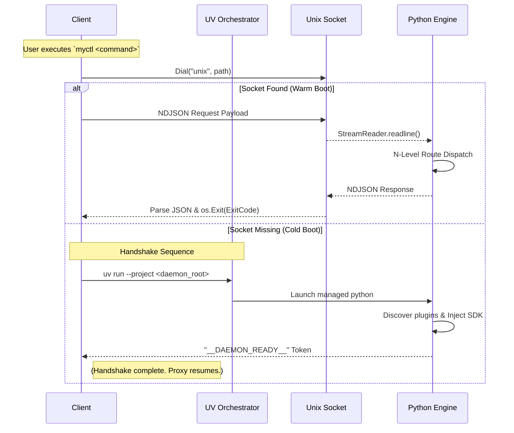

# Architecture: The Managed Runtime Engine

MyCTL subverts the traditional CLI model. Instead of hardcoding commands, parsing logic, and execution functions into a single compiled binary, MyCTL employs a **100% Logic-Less Client** orchestrated by **UV** and backed by a **Persistent Python Engine**.

This architecture guarantees sub-millisecond CLI responsiveness from a portable Client, while maintaining a rich, stateful, and dynamically extensible backend environment that is entirely self-managed.

## 🗺️ Codebase Topology

To understand the architecture, developers must first map the concepts to the physical repository. The codebase is strictly bifurcated:

- **`cmd/` (The Client Layer)**
  - `main.go`: The central entry point. Responsible for dialing the Unix Socket, fetching the JSON schema, inflating the Cobra CLI tree, and proxying raw arguments to the engine.
  - `daemon.go`: The **UV-Native Orchestrator**. Only invoked if the Unix Socket is missing. It manages the runtime environment and launches the engine.
- **`daemon/` (The Engine Layer)**
  - `myctld`: The Python entry point. An extremely lean bootstrapper designed for execution via `uv run`.
  - `myctl/core/registry.py`: The brain. Constructs the $O(1)$ routing dictionary, loads plugins via `importlib`, and handles SDK auto-injection.
  - `myctl/core/ipc.py`: The `asyncio` Unix Socket server loop.
- **`plugins/` (The Extension Tier)**
  - Tiered directories containing a `pyproject.toml` manifest and a standard `main.py` logic entry.

---

## 🏎️ The Logic-Less Client

The `myctl` Client is designed to guarantee ultra-fast cold starts and a zero-dependency system footprint. However, its source code contains zero domain logic—it doesn't even know what commands it supports natively.

### 1. Dynamic Tree Inflation (`spf13/cobra`)

Usually, developers hardcode commands via `rootCmd.AddCommand()`. MyCTL instead fetches a JSON payload from the Python daemon during initialization. The client recursively traverses this JSON using the `buildCobraCommand` function, unmarshaling the payload into living `*cobra.Command` pointers.

This means the Client automatically inherits new features and documentation updates directly from Python without ever requiring a recompile.

Because the Client builds its CLI tree dynamically, it cannot know ahead of time what specific flags (e.g., `--volume 50`) a deeply nested plugin might require. To prevent Cobra from failing, the Client applies a global bypass:
...
This forces Cobra to collect unmapped flags and pass them blindly into the unparsed argument slice. The Client then shovels this raw array across the IPC tunnel, allowing Python to perform the actual deterministic parsing.

### 3. Pristine Console Output

Standard system loggers are often unsuitable for professional CLI tools. MyCTL leverages `zerolog` with a heavily customized `ConsoleWriter`. We strip timestamps and generic field names to provide color-coded terminal output that mimics native shell applications.

---

## 🧠 The Persistent Engine (Python)

The core execution logic resides in a continuous, stateful `myctld` Python daemon ({{metadata.versions.python_min}}). While Python scripts are traditionally slow to start, pushing the engine into the background solves this constraint while maintaining a rich system-integration ecosystem.

### 1. Asynchronous Concurrency (`asyncio`)

The daemon implementation is built entirely on `asyncio`. It binds to a Unix Socket using `asyncio.start_unix_server`, which assigns every incoming connection to a unique task in the event loop.

- **Concurreny Strategy**: Each `handle_client` invocation is an independent coroutine. This allows a plugin performing a long-running system call (e.g., `subprocess.run`) to yield control back to the loop, ensuring that `ping` or `status` requests from other CLI instances remain responsive.
- **Event Loop Management**: The daemon runs a single-threaded event loop, leveraging non-blocking socket IO. This architecture is perfect for a CLI controller where the primary bottleneck is high-latency system integration rather than raw CPU calculation.

### 2. The IPC Lifecycle (`handle_client`)

Every interaction between the Client and Engine follows a strict Request/Response lifecycle managed by the `DaemonServer`:

1.  **Read (NDJSON)**: The `asyncio.StreamReader` waits for a single newline-delimited line. The Engine expects a JSON object matching the `Request` schema (path, args, cwd, env).
2.  **Inflation**: The raw JSON is unmarshaled into a Python `Request` object.
3.  **Dispatch**: The `CommandRegistry` traverses its internal memory map to find the target `handler`.
4.  **Write**: The result is serialized to NDJSON and pushed to the `asyncio.StreamWriter`.
5.  **Drain & Close**: The Engine calls `writer.drain()` to ensure the buffer is flushed before explicitly closing the connection. The Client receives the EOF, parses the status, and terminates.

### 3. Sandbox Isolation & UV Integration

Furthermore, absolutely everything the daemon touches adheres to strict XDG Base Directory standards:

| Component        | Path Strategy                          | Default Environment Path     |
| :--------------- | :------------------------------------- | :--------------------------- |
| **Sandbox Venv** | `xdg.DataHome`                         | `{{metadata.paths.venv}}`    |
| **User Plugins** | `xdg.DataHome`                         | `{{metadata.paths.plugins}}` |
| **Socket IPC**   | `xdg.RuntimeDir` -> `$UID` -> fallback | `{{metadata.paths.socket}}`  |

---

## 🔄 Core Operational Flow

The interaction is completely governed by the status of the Unix Socket.

