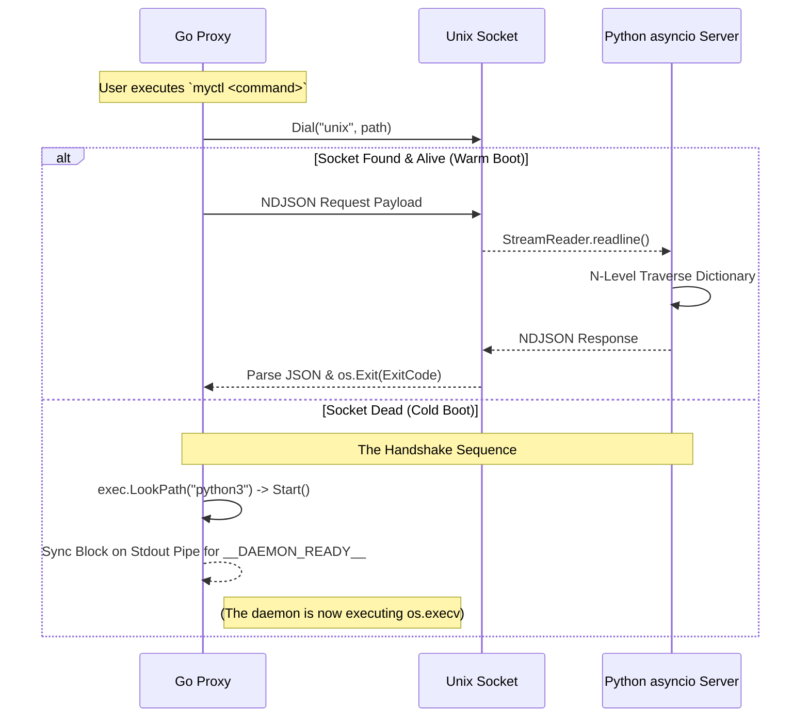

# Architecture: The Agnostic Engine

MyCTL subverts the traditional CLI model. Instead of hardcoding commands, parsing logic, and execution functions into a single compiled binary, MyCTL employs a **100% Logic-Less Go Proxy** backing into a **Self-Managing Python Server**.

This architecture guarantees sub-millisecond CLI responsiveness from a portable binary, while maintaining a rich, stateful, and dynamically extensible backend environment.

## 🗺️ Codebase Topology

To understand the architecture, developers must first map the concepts to the physical repository. The codebase is strictly bifurcated:

- **`cmd/` (The Proxy Layer)**
  - `main.go`: The central Go tunnel. Contains zero command logic. Responsible for dialing the Unix Socket, fetching the JSON schema, inflating the Cobra CLI tree, and proxying `os.Args`.
  - `daemon.go`: The fallback bootstrapper. Only invoked if the Unix Socket is missing.
- **`daemon/` (The Engine Layer)**
  - `myctld`: The Python entry point. Strictly responsible for XDG environment synchronization and `uv` process replacement.
  - `myctl/core/registry.py`: The brain. Constructs the $O(1)$ routing dictionary, loads plugins via `importlib`, and serves the `schema` endpoint.
  - `myctl/core/ipc.py`: The `asyncio` Unix Socket server loop.
- **`plugins/` (The Extensibility Layer)**
  - Drop-in directories (e.g., `audio/`) containing a `pyproject.toml` manifest and standard `main.py` entry point.


## 🏎️ The Logic-Less Client (Go)

The `myctl` binary is written in Go to guarantee ultra-fast cold starts and a zero-dependency system footprint. However, its source code contains zero domain logic—it doesn't even know what commands it supports natively.

### 1. Dynamic Tree Inflation (`spf13/cobra`)

Usually, developers hardcode commands via `rootCmd.AddCommand()`. MyCTL instead fetches a JSON payload representing the entire command hierarchy (Internal System Handlers + Discovered Plugins) from the Python daemon during initialization.

The client recursively traverses this JSON using the `buildCobraCommand` function, unmarshaling the payload into living `*cobra.Command` pointers. This means the Go binary automatically inherits new features and documentation updates directly from Python without ever requiring a recompile.

### 2. The Unknown Flags Hack

Because the Go proxy builds its CLI tree dynamically, it cannot know ahead of time what specific flags (e.g., `--volume 50`, `--json`) a deeply nested plugin might require.

To prevent Cobra from immediately failing and printing "Error: unknown flag", the client explicitly applies a global bypass:

```go
cmd.FParseErrWhitelist.UnknownFlags = true
```

This crucial hack forces Cobra to collect unmapped flags and pass them blindly into the unparsed `os.Args[1:]` slice. The Go proxy then shovels this raw array across the IPC tunnel, allowing Python to perform the actual deterministic parsing.

### 3. Streamlined Logging (`rs/zerolog`)

Standard Go loggers or generic formatting prints are often unsuitable for professional CLI tools. MyCTL uses `zerolog`, but heavily customizes the `ConsoleWriter` in `cmd/main.go`.

We strip out timestamps (unless in debug mode), JSON brackets, and generic field names, overriding `FormatLevel` and `FormatFieldName` to provide pristine, color-coded terminal output that mimics native shell applications.


## 🧠 The Intelligent Server (Python)

The core execution logic resides in a continuous, stateful `myctld` Python daemon (3.13+). Python was chosen for its unparalleled system-integration ecosystem, but running Python scripts iteratively from a cold start is too slow for CLI responsiveness. Pushing the engine into the background solves this constraint.

### 1. Asynchronous Concurrency (`asyncio`)

The daemon binds to the Unix Socket using `asyncio.start_unix_server`. This architecture is mandatory: it ensures that a single, long-running task (e.g., a slow HTTP request to a weather API) never halts the execution loop. Because the proxy issues discrete NdJSON requests, concurrent CLI interactions (like instantly muting the audio while waiting for the weather response) can be processed flawlessly in the same event loop.

### 2. Zero Global Execution & XDG

Python scripts notoriously pollute global system namespaces or trigger conflicts with system package managers (`pacman`, `apt`).

The `myctld` server structurally insulates itself. It strictly refuses to execute its libraries under the system's `sys.prefix`. If the Go proxy attempts to launch the daemon from a global `$PATH`, the daemon autonomously spawns an isolated `uv` virtual environment and replaces its own process image to lock itself inside the sandbox (detailed entirely in [Self-Sustaining Lifecycle](bootstrapping.md)).

Furthermore, absolutely everything the daemon touches adheres to strict XDG Base Directory standards:

| Component        | Variable Resolution Strategy           | Default Environment Path           |
| :--------------- | :------------------------------------- | :--------------------------------- |
| **Sandbox Venv** | `xdg.DataHome`                         | `~/.local/share/myctl/venv`        |
| **User Plugins** | `xdg.DataHome`                         | `~/.local/share/myctl/plugins`     |
| **Socket IPC**   | `xdg.RuntimeDir` -> `$UID` -> fallback | `/run/user/$UID/myctl/myctld.sock` |


## 🔄 Core Operational Flow

The interaction is completely governed by a simple check: **Is the Unix Socket alive?**


