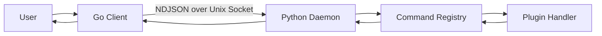

# System Architecture

## Goal

MyCTL is designed to keep command execution fast while allowing dynamic plugin-based behavior.

It does this with a **lean client + persistent daemon** model:

- Go client: fast startup, argument forwarding, output rendering
- Python daemon: command registry, plugin loading, lifecycle management

---

## High-Level Components

### 1. Client Layer (Go)

Location: `cmd/`

- Builds CLI surface from daemon-provided schema
- Sends command requests over Unix socket
- Handles daemon bootstrap when needed

Main files:

- `cmd/main.go`
- `cmd/daemon.go`

### 2. Daemon Layer (Python)

Location: `daemon/myctld/`

- Runs continuously in background
- Loads/discovers plugins
- Dispatches command handlers
- Returns NDJSON responses

Main files:

- `daemon/myctld/app.py`
- `daemon/myctld/ipc.py`
- `daemon/myctld/registry.py`

### 3. Plugin Layer

Location: `plugins/` (plus user/system plugin paths)

- Extends command tree
- Registers commands via SDK decorators
- Keeps implementation in `src/`

---

## Runtime Request Flow

Step-by-step:

1. User runs `myctl <path> [args]`.
2. Client sends request payload to daemon.
3. Daemon resolves handler in registry.
4. Plugin handler executes.
5. Daemon returns status/data/exit code.
6. Client prints output and exits.

---

## Why This Split Exists

### Fast UX

The Go binary starts quickly, even for tiny commands.

### Dynamic Features

The daemon can discover plugin commands at runtime, so command surface is not hardcoded in the client.

### Better Extensibility

Plugin authors only touch Python plugin code; no Go client rebuild needed for new plugin commands.

---

## Cold Boot vs Warm Run

### Warm Run

- Daemon is already online
- Client connects and executes immediately

### Cold Boot

- Daemon socket is missing/offline
- Client runs `uv sync`, then launches managed venv Python (`python -m myctld`)
- After daemon signals ready, request proceeds

See [Bootstrapping](./bootstrapping.md) for full lifecycle details.

---

## Core Contracts Between Client and Daemon

### IPC Contract

All communication uses newline-delimited JSON over Unix socket.

See [IPC Protocol](./ipc-protocol.md).

### Schema Contract

Client asks daemon for command schema and inflates CLI tree dynamically.

See [Core Engine and Registry](./registry.md).

### Plugin Contract

Plugin ID is directory name, and package-context loading isolates imports.

See [Plugin Loading](../plugin-system/plugin-loading.md) and [Plugin Discovery](../plugin-system/plugin-discovery.md).

---

## Common Failure Boundaries

### Client Side

- Daemon not reachable
- Bootstrap failure

### Daemon Side

- Plugin validation failure
- Dependency sync failure
- Import/runtime exceptions in plugin handlers

MyCTL is designed to keep daemon alive even when individual plugins fail to load.

---

## Summary

- Go client is intentionally thin.
- Python daemon owns business logic.
- Registry and plugins provide extensibility.
- Package-context loading prevents plugin import collisions.
- IPC keeps contract simple and observable.

---

## Current Command Semantics

- `myctl start`: runs daemon in foreground (direct terminal attach).
- `myctl start -b`: starts daemon in background via bootstrap path.
- `myctl stop`: graceful daemon shutdown and socket cleanup.
- `myctl logs`: reads recent daemon log lines.
