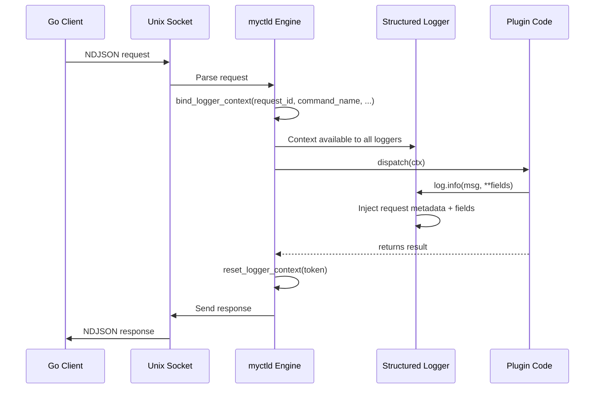

# Request Context and Logging: Scope-Bound Metadata

When a request arrives via IPC, MyCTL needs to track metadata across the whole execution lifecycle: parsing the command, dispatching the handler, logging, and building the response.

Rather than passing the same metadata object through every function call, the daemon uses request-scoped context binding via Python's `contextvars` module.

In plain terms, `contextvars` lets the daemon remember which request is active right now even when code jumps across async tasks.

This design keeps the API clean while ensuring every log record contains the full request metadata.

---

## 1. The Request Lifecycle

Every `myctl` command follows this sequence:



### Key Steps

1. **Parse Request**: The IPC handler extracts `path`, `args`, `cwd`, `terminal`, and `env` from the incoming NDJSON payload.

2. **Bind Logger Context**: Before executing any user code, the engine calls `bind_logger_context()` with request-level metadata:
   ```python
   request_token = bind_logger_context(
       request_id=ctx.request_id,
       command_name=ctx.command_name,
       plugin_id=ctx.plugin_id,
   )
   ```

3. **Dispatch**: The registry routes the command to its handler (a daemon command or plugin command).

4. **Automatic Log Injection**: Every `log.info()`, `log.warning()`, `log.error()` call **automatically includes** the request metadata from the context.

5. **Cleanup**: After the response is sent, the engine calls `reset_logger_context(token)` to clear the binding, preventing context leakage between requests.

---

## 2. Context Binding via ContextVar

Python's `contextvars` module provides **task-local storage** that is safe across async boundaries. MyCTL uses a single `ContextVar`:

That is better than a global variable because concurrent requests would otherwise overwrite each other.

```python
_CURRENT_LOG_CONTEXT: ContextVar[dict[str, object]] = ContextVar(
    "myctl_current_log_context", default={}
)
```

### Binding and Resetting

```python
# Bind: Activate request-scoped metadata
token = bind_logger_context(request_id="req-001", plugin_id="audio")

# ... code runs with context available ...

# Reset: Clean up after request completes
reset_logger_context(token)
```

The `token` is a `contextvars.Token` object that remembers the **previous state**. When reset, it restores that state, enabling safe nesting of requests.

### Why ContextVar Instead of Thread-Local?

- **Async-Safe**: Works correctly with `asyncio`. Traditional `threading.local` does not.
- **Task Isolation**: Each concurrent task has its own isolated context.
- **No Manual Cleanup Required**: Python's async runtime automatically isolates context between tasks.

That makes it the right tool for a daemon that can serve multiple requests over time.

---

## 3. The _ContextFilter

Behind the scenes, a `_ContextFilter` (a `logging.Filter`) automatically injects request metadata into every log record:

```python
class _ContextFilter(logging.Filter):
    def filter(self, record: logging.LogRecord) -> bool:
        # Get current context
        context = _CURRENT_LOG_CONTEXT.get()

        # Inject request metadata onto the record
        for key in (
            "request_id",
            "plugin_id",
            "command_name",
            "hook_name",
            "event",
            "error_code",
            "duration_ms",
        ):
            if key in context and not hasattr(record, key):
                setattr(record, key, context[key])

        # Merge context fields + log-specific fields
        context_fields = context.get("fields", {})
        record_fields = getattr(record, "fields", {})
        merged_fields: dict[str, object] = {}
        merged_fields.update(context_fields)  # Context wins
        merged_fields.update(record_fields)   # Log-specific overrides
        record.fields = merged_fields

        return True
```

This filter is registered on the root logger during daemon startup, so **every logger in the system automatically inherits the current request context**.

---

## 4. Structured Field Support

Plugins can attach keyword arguments to log calls, which are stored in the `fields` object:

```python
# In a plugin command or hook
log.info("processing request", user="soymadip", duration_ms=42)

# Generated JSONL record:
{
  "ts": "2026-04-02T14:23:51.123456Z",
  "level": "INFO",
  "component": "myctl.plugin.audio",
  "message": "processing request",
  "request_id": "req-001",        # from context
  "plugin_id": "audio",           # from context
  "command_name": "audio volume", # from context
  "fields": {
    "user": "soymadip",           # from log call
    "duration_ms": 42             # from log call
  }
}
```

### Field Merging

If both context and the log call provide a field with the same name, **the log-specific value wins**:

```python
# Context has: {"fields": {"user": "daemon"}}
log.info("msg", user="plugin")

# Result: fields.user = "plugin"
```

---

## 5. The Public Logger API

The `myctl.api.log` facade exposes all standard Python logging levels:

```python
from myctl.api import log

log.debug(msg, **fields)
log.info(msg, **fields)
log.warning(msg, **fields)
log.error(msg, **fields)
log.exception(msg, **fields)  # Includes exception traceback
```

Each method accepts:
- `msg` (str): The log message.
- `*args` (optional): Positional arguments for message formatting (e.g., `log.info("User %s logged in", username)`).
- `**fields` (dict): Keyword arguments that are stored in the `fields` object of the JSONL record.

---

## 6. Request Metadata Sources

Request metadata is populated from multiple sources:

| Source           | Example Value               | Binding Point                          |
| :--------------- | :-------------------------- | :------------------------------------- |
| IPC Request      | `request_id="req-f8a4..."`  | Engine parses from payload             |
| Command Router   | `command_name="volume set"` | Registry resolves path before dispatch |
| Plugin Loader    | `plugin_id="audio"`         | Manager sets when loading plugin code  |
| Hook Execution   | `hook_name="on_load"`       | Plugin manager before calling hook     |
| Command Dispatch | `event="command"`           | Registry marks the event type          |

When a plugin calls `log.info()`, all of these fields are already available in the current context.

---

## 7. Example: Full Request Trace

Here's a complete example showing how the entire flow works:

**Plugin code** (`plugins/audio/main.py`):
```python
from myctl.api import Plugin, log

plugin = Plugin()

@plugin.command("volume set", help="Set volume")
@plugin.flag("level", short="l", default=None, help="Volume level (0-100)")
def set_volume(ctx):
    log.info("setting volume", level=ctx.flags["level"])
    # ... actual logic ...
    return {"status": "ok", "volume": ctx.flags["level"]}

@plugin.on_load
async def setup(ctx):
    log.info("audio plugin loaded")
```

**Daemon execution** (`myctld/app.py`):
```python
# ... IPC request arrives: {"path": ["audio", "volume", "set"], ...} ...

# 1. Parse request
request_id = "req-f8a4d2cc"
command_name = "audio volume set"
plugin_id = "audio"

# 2. Bind context (before dispatch)
request_token = bind_logger_context(
    request_id=request_id,
    command_name=command_name,
    plugin_id=plugin_id,
)

try:
    # 3. Dispatch to plugin
    result = await registry.dispatch(ctx)
finally:
    # 4. Clean up (after response)
    reset_logger_context(request_token)
```

**Generated logs**:
```json
{"ts": "2026-04-02T14:23:51.123456Z", "level": "INFO", "component": "myctl.plugin.audio", "message": "audio plugin loaded", "request_id": null, "plugin_id": "audio", "event": "on_load"}
{"ts": "2026-04-02T14:23:52.234567Z", "level": "INFO", "component": "myctl.plugin.audio", "message": "setting volume", "request_id": "req-f8a4d2cc", "plugin_id": "audio", "command_name": "audio volume set", "fields": {"level": "80"}}
```

---

## 8. Performance Implications

This design has negligible overhead:

- **ContextVar lookup**: $O(1)$ dictionary lookup per log call.
- **No allocation**: Context values are stored in a dictionary, not copied per log call.
- **Async-safe**: No locks, contention, or busy-waiting.
- **No runtime overhead for non-logging code**: Plugins don't pay a cost for unused context.

The result is that MyCTL's structured logging does not impact command execution latency.

---

## 9. Debugging with Logs

To diagnose issues in plugin execution:

```bash
myctl logs --level=DEBUG --filter='plugin_id=audio'
```

The structured JSONL format makes filtering and analysis straightforward:
- Filter by `request_id` to trace a single invocation.
- Filter by `plugin_id` to isolate a specific plugin's activity.
- Filter by `hook_name` to trace lifecycle events.
- Search `fields` for custom plugin-specific metadata.
