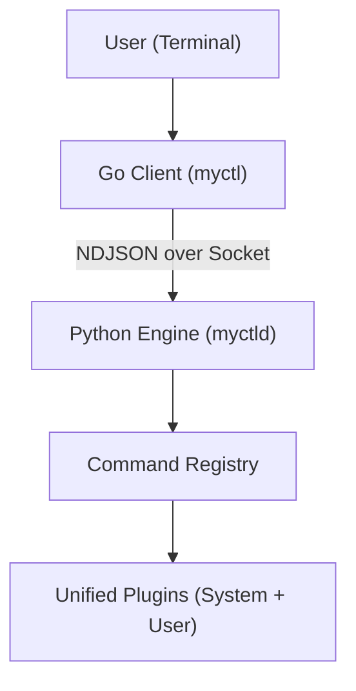

# System Architecture

MyCTL is built on a **Lean Client / Fat Server** model. This design keeps the command-line interface fast while moving all complex logic into a persistent background engine.

## 1. High-Level Blueprint

The system consists of three main layers that communicate over a fast Unix socket.

### The Three Layers

1.  **The Client (`cmd/`)**: A tiny [Go]({{ metadata.tools.go }}) binary. Its only job is to ask the Engine for a "map" of commands, show them to the user, and forward the user's request to the Engine.
2.  **The Engine (`daemon/myctld/`)**: The source of truth. It stays running in the background, handles the real work (disk access, network, etc.), and manages the plugins.
3.  **The SDK (`daemon/myctl/`)**: A thin set of "Rules" (Interfaces) that plugins use to talk to the Engine securely. Current version: **{{ metadata.versions.api }}**.

---

## 2. The Contract Boundary

To keep the system stable and the SDK lightweight, we enforce a strict **Dependency Inversion** model.

> [!IMPORTANT]
> **The Rule of Imports**: The **SDK (`myctl`)** is the canonical source of truth (the "Contract") for the IPC protocol. The **Engine (`myctld`)** must import these definitions to ensure it adheres to the public contract.

### Why the Engine imports the SDK?

- **Zero-Dependency SDK**: Plugins must remain "lean." If the SDK imported the Engine, every plugin would pull in the Engine's heavy dependencies (DBus, PulseAudio, Pydantic). By defining the protocol in the SDK, plugins stay lightning-fast.
- **Strict Isolation**: The SDK acts as the "Rulebook." Both the Engine and Plugins must follow these rules. This ensures that even as the Engine's internal logic evolves, the interface for plugins remains stable and decoupled from implementation details.
- **Single Source of Truth**: Protocol constants (like `ResponseStatus`) are defined once in the SDK. If the Engine needs to change a status code, it must update the "Contract" first, ensuring the change is visible to all plugin developers.

---

## 3. Responsibility Matrix

| Component   | Responsibility                                                     | Technology         |
| :---------- | :----------------------------------------------------------------- | :----------------- |
| **Client**  | CLI entry, argument parsing, rendering output.                     | Go                 |
| **Engine**  | IPC server, Command routing, Plugin discovery, File/System access. | Python (asyncio)   |
| **SDK**     | Decorators (`@command`), Types (`Context`), and Logic interfaces.  | Python (Protocols) |
| **Plugins** | Custom features and specialized commands.                          | Python             |

---

## 4. Logical File Map

The Engine is organized into clear sub-packages:

### Engine (`daemon/myctld/`)

- `core/`: Fundamental logic (Models, IPC, Config).
- `services/`: Helper logic (Logging, Styling).
- `plugins/`: The unified loader and the `internal/` system commands.
- `app.py`: The main server loop.
- `registry.py`: The dispatcher that routes requests to handlers.

### SDK (`daemon/myctl/`)

- `context.py`: Defines what a "Command Context" looks like.
- `plugin.py`: The decorators for building plugins.
- `style.py`: The interface for pretty-printing to the terminal.
