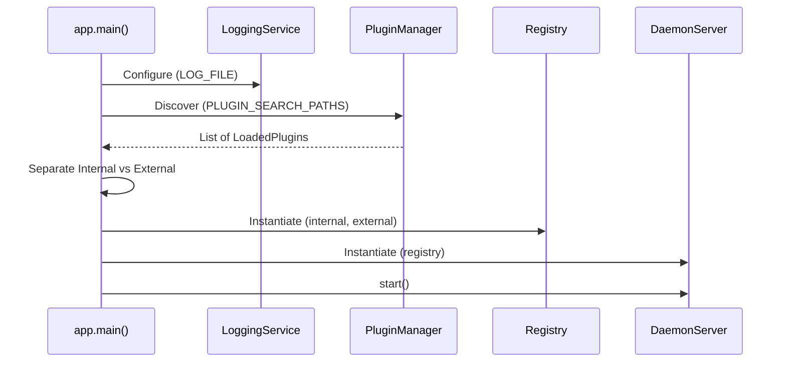

# Engine Bootstrapping & Handshake

This page provides a deep-dive into the Engine's startup sequence. Understanding the bootstrapping process is critical for debugging "Cold Boot" issues and ensuring the Go Client stays synchronized with the daemon.

## 1. Process Entrypoint

The Engine starts from the `daemon/myctld/__main__.py` module. Its main responsibility is to set the process title to `{{ metadata.title }}` and delegate execution to `myctld.app.main()`.

```python
# daemon/myctld/__main__.py
if __name__ == "__main__":
    if setproctitle is not None:
        setproctitle(APP_NAME)
    # asyncio.run manages loop creation/teardown
    raise SystemExit(asyncio.run(main()))
```

---

## 2. Startup Sequence Logic

The `main()` function in `app.py` coordinates the initialization of all Engine subsystems.



### The Single-Instance Lock
Before opening the Unix socket, the Engine performs a **"Socket Probe"** to ensure no other daemon is already running.

```python
# From DaemonServer.start()
if SOCKET_PATH.exists():
    with socket.socket(socket.AF_UNIX, socket.SOCK_STREAM) as probe:
        # connect_ex returns 0 if the socket is ACTIVE
        if probe.connect_ex(str(SOCKET_PATH)) == 0:
            raise RuntimeError(f"daemon already running")
    # If the probe failed, the socket file is "stale" and must be unlinked
    SOCKET_PATH.unlink()
```

---

## 3. The `__DAEMON_READY__` Handshake

The Go Client launches the Engine using a subprocess and waits for a specific signal before attempting to connect.

1.  **Engine**: Completes all initialization and starts the `asyncio` server.
2.  **Engine**: Prints `__DAEMON_READY__` to `stdout` and flushes.
3.  **Client**: Scans the Engine's output for this exact string.
4.  **Client**: Once found, it establishes the first Unix socket connection.

> [!IMPORTANT]
> **Why this handshake?** Starting an `asyncio` server is fast, but loading 50+ plugins might take 1-2 seconds. This handshake prevents the Client from attempting to connect before the Engine is actually listening.

---

## 4. Initialization Phase: Internal vs External
The Engine treats system commands as **Internal Plugins**. They are loaded from the first tier of `PLUGIN_SEARCH_PATHS`.

```python
# From app.py
internal_path = PLUGIN_SEARCH_PATHS[0]
for pid, loaded in discovered.items():
    if Path(loaded.entrypoint).is_relative_to(internal_path):
        internal[pid] = loaded
    else:
        external[pid] = loaded

registry = Registry(plugins=external, internal_plugins=internal)
```

This separation ensures that only plugins coming from the Engine's own source-tree can receive the privileged `SystemContext`.
