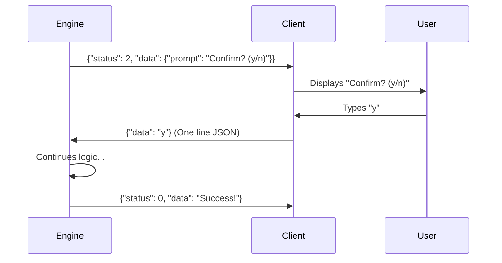

# IPC Protocol & Wire Format

MyCTL uses **NDJSON** (Newline Delimited JSON) for communication between the Go Client and the Python Engine. This protocol is simple, human-readable, and easy to debug.

## 1. The Wire Format

All messages are exactly one line of JSON, followed by a newline (`\n`).

- **Socket**: Unix Domain Socket at `{{ metadata.paths.socket }}`.
- **Direction**: The Client always initiates a request, and the Engine always responds.

---

## 2. Request Payload (Client -> Engine)

The Client sends exactly one JSON object at the start of a connection.

### Request Fields

| Field        | Type        | Description             | Simple Example                  |
| :----------- | :---------- | :---------------------- | :------------------------------ |
| `path`       | `list[str]` | The command parts.      | `["volume", "set"]`             |
| `args`       | `list[str]` | Positional arguments.   | `["50"]`                        |
| `flags`      | `dict`      | Key/Value flags.        | `{"mute": true}`                |
| `env`        | `dict`      | The user's environment. | `{"HOME": "/home/user"}`        |
| `terminal`   | `dict`      | TTY metadata.           | `{"width": 80, "is_tty": true}` |
| `request_id` | `str`       | Unique ID for tracing.  | `"abc-123"`                     |

### Example Request

```json
{
  "path": ["status"],
  "args": [],
  "flags": {},
  "env": { "USER": "soymadip" },
  "terminal": { "width": 120, "height": 40, "is_tty": true },
  "request_id": "req-99"
}
```

---

## 3. Response Payload (Engine -> Client)

The Engine can send multiple lines. Most lines are data, but the **FINAL** line is always a "Terminal Response."

### Status Codes

| Status    | Code | Meaning                                      |
| :-------- | :--- | :------------------------------------------- |
| **OK**    | `0`  | Command finished successfully.               |
| **ERROR** | `1`  | Command failed or crashed.                   |
| **ASK**   | `2`  | Engine needs more info (Interactive Prompt). |

### Example OK Response

```json
{ "status": 0, "data": "Volume set to 50%", "exit_code": 0 }
```

> [!NOTE]
> **Implementation Note**: These status codes are not arbitrary; they are canonically defined in the `myctl` SDK as the `ResponseStatus` protocol enum. The Engine imports these values directly to ensure the wire format never drifts from the published SDK.

---

## 4. The Interactive "Ask" Flow

Sometimes a command needs user input (e.g., a confirmation). The Engine sends a **Status 2** message to trigger this.



### Protocol Steps:

1.  **Request**: Client sends command.
2.  **Prompt**: Engine sends Status 2 packet.
3.  **Answer**: Client reads prompt, blocks for user input, and sends the answer back to the _same_ socket connection.
4.  **Final**: Engine reads the answer, finishes the work, and sends a final Status 0/1 packet before closing the socket.

---

## 5. Why Not Binary?

We chose NDJSON over a binary protocol (like Protobuf) because:

- **Observability**: You can "sniff" the socket with `nc -lU /tmp/myctl.sock` and read the messages directly.
- **Flexibility**: Adding a new field (like `request_id`) doesn't break old versions of the Engine or Client.
- **Simple Parsing**: Python and Go both have extremely fast, built-in JSON libraries.
