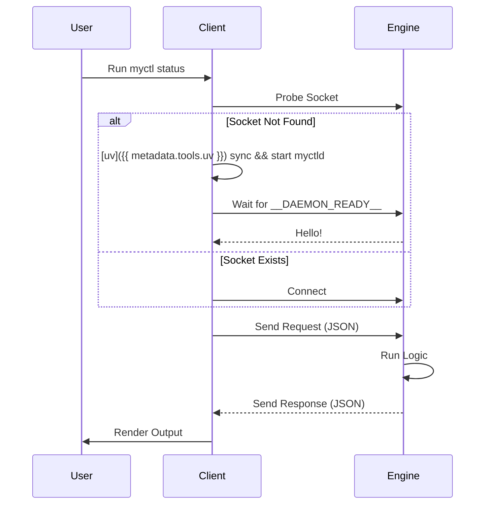
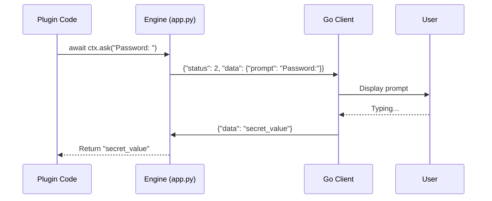

# Engine Runtime & Lifecycle

This page explains how the MyCTL Engine (`myctld`) starts, stays alive, and handles requests.

## 1. The Daemon Lifecycle

The Engine is a persistent background process. It only starts once, and every subsequent client request (`myctl <command>`) talks to this already-running instance.



---

## 2. Server Architecture: `DaemonServer`

The heart of the Engine is the `DaemonServer` class (located in `daemon/myctld/app.py`). It uses Python's **`asyncio`** library to handle many client connections at once without blocking.

### `handle_client()` Deep Dive

Every connection from the Go client starts an independent `handle_client()` task. This function manages the raw NDJSON stream and enforces the request-response contract.

#### Phase 1: Context Construction
The server first parses the incoming JSON and builds a privileged `SystemContext`. This context is a technical container that travels through the Engine's routing logic.

```python
# Phase 1: Build the privileged SystemContext. 
base_ctx = make_context(raw_data)
ctx = SystemContext(
    path=base_ctx.path,
    args=base_ctx.args,
    flags=base_ctx.flags,
    request_id=base_ctx.request_id,
    command_name=base_ctx.command_name,
    _shutdown_trigger=self.request_shutdown,
    _registry=self.registry
)
```

#### Phase 2: The `ask()` Handshake
The SDK's `ask()` method is not a local prompt; it is a multi-turn IPC handshake. The Engine sends a special "Status 2" response to the client, effectively "pausing" the execution and waiting for user input.



#### Phase 3: Unified Dispatch
The Engine hands the context to the `Registry`, which determines if the command is internal or external and executes the appropriate handler.

---

## 3. Signal Handling (Graceful Exit)

The Engine is designed to clean up after itself even if it is interrupted. It listens for two main signals:
- **SIGINT (Ctrl+C)**: Usually during manual debugging.
- **SIGTERM**: Sent by the operating system or `myctl stop`.

---

## 4. Key Implementation Details

*   **File**: `daemon/myctld/app.py`
*   **Concurrency**: Each `handle_client` run is an independent "Task." This means one slow command (like a network fetch) won't block other users from checking `myctl status`.
*   **Heartbeat**: The Engine doesn't use a heartbeat; instead, the presence of the socket file on disk is the source of truth for the "Warm Run" status.
