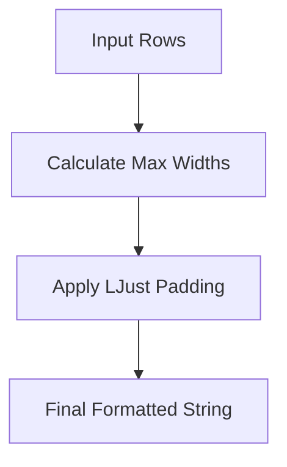

# Internal Engine Services

The MyCTL Engine provides several "Foundation Services" that handle cross-cutting concerns like logging and terminal styling. These services are internal to `myctld` but are designed specifically to satisfy the structural protocols defined in the SDK.

## 1. Structured Logging Service

The logging service (`daemon/myctld/services/logging.py`) ensures that every log line emitted by the engine or a plugin is tagged with the correct request metadata.

### Context Propagation

The service uses Python's `contextvars` to track `command_name` and `plugin_id` across asynchronous boundaries.

```python
# daemon/myctld/services/logging.py
_CURRENT_LOG_CONTEXT: ContextVar[Mapping[str, Any]] = ContextVar(
    "log_context", default={}
)

def bind_logger_context(**kwargs: Any) -> Any:
    """Bind key/value pairs to the current async log context."""
    current = dict(_CURRENT_LOG_CONTEXT.get())
    current.update(kwargs)
    return _CURRENT_LOG_CONTEXT.set(current)
```

### Log Record Enrichment

A custom `logging.Filter` automatically injects these context variables into every `LogRecord` before it is formatted.

```python
class _ContextFilter(logging.Filter):
    def filter(self, record: logging.LogRecord) -> bool:
        ctx = _CURRENT_LOG_CONTEXT.get()
        record.plugin_id = ctx.get("plugin_id", "core")
        record.command_name = ctx.get("command_name", "none")
        return True
```

### Format Specification

The standard format string used by all Engine handlers:
`[%(asctime)s] [%(levelname)s] [%(plugin_id)s] [%(command_name)s] %(message)s`

---

## 2. Style & Terminal Service

The Style service (`daemon/myctld/services/style.py`) provides the implementation for the SDK's `style` protocol. It translates high-level formatting requests (like `bold` or `table`) into raw ANSI sequences based on the client's reported terminal capabilities.

### Capability Detection

The `StyleHelper` respects the `TerminalContext` sent by the Go client, including `no_color` and `is_tty` flags.

```python
class StyleHelper:
    def __init__(self, terminal: TerminalContext):
        self.terminal = terminal
        self.use_color = not terminal.no_color

    def bold(self, text: str) -> str:
        if not self.use_color:
            return text
        return f"\033[1m{text}\033[0m"
```

### Table Rendering

The service includes a lightweight table generator that calculates column widths dynamically to ensure clean CLI output.



---

## 3. Protocol Satisfaction

By keeping these implementations in the `services/` package, the Engine maintains a clean separation of concerns. The SDK merely defines the **Protocol** (The "What"), and the Engine provides the **Service** (The "How").

| Service | SDK Protocol    | Implementation File   |
| :------ | :-------------- | :-------------------- |
| Logging | `Logger`        | `services/logging.py` |
| Styling | `StyleProtocol` | `services/style.py`   |
