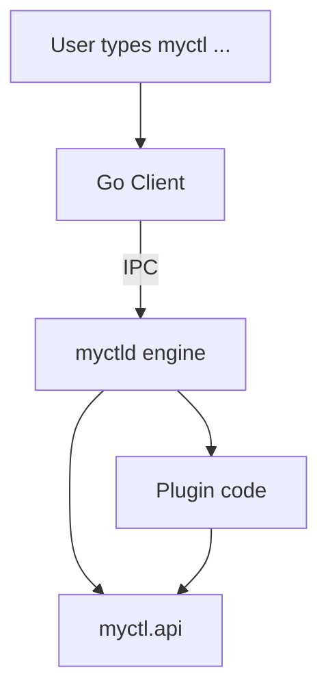
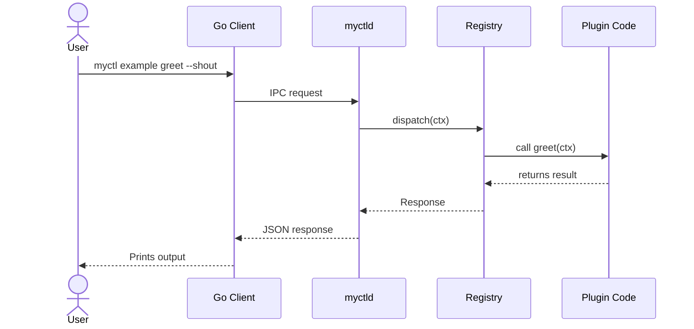

This document is the single plan for the daemon redesign.

It is written to match the current plugin SDK style already used in the docs:

- `Plugin()`
- `@plugin.command(...)`
- `@plugin.flag(...)`

So the goal is **not** to invent a new plugin style. The goal is to keep the same style, but make the daemon engine cleaner, safer, and easier to understand.

## 1. Big Picture

MyCTL has two parts:

- the **Go client**, which is a fast messenger
- the **Python daemon**, which does the real work

The daemon should be split into two clear areas:

- **`myctld`**: the private daemon engine
- **`myctl.api`**: the public plugin SDK

Plugins should only depend on `myctl.api`. They should not import daemon internals.



### 1.1 Target `daemon/` Directory Structure

```text
daemon/
├── myctld                      # existing launcher script (transitional)
├── pyproject.toml
├── myctl/
│   ├── __init__.py
│   └── api/
│       ├── __init__.py
│       ├── commands.py         # @plugin.command API
│       ├── flags.py            # @plugin.flag / @plugin.flags API
│       ├── context.py          # public Context
│       ├── logger.py           # public log facade
│       ├── types.py            # public typed models/protocols
│       └── py.typed            # typed-package marker
└── myctld/
    ├── __init__.py
    ├── __main__.py             # python -m myctld entrypoint
    ├── app.py                  # daemon startup + lifecycle
    ├── boot.py                 # environment/bootstrap logic
    ├── config.py               # runtime/config paths
    ├── ipc.py                  # socket protocol handling
    ├── registry.py             # command tree + dispatch only
    ├── plugin/
    │   ├── __init__.py
    │   ├── manager.py          # discovery/load/unload/reload/hooks
    │   ├── loader.py           # import/loading helpers
    │   └── models.py           # plugin runtime models
    ├── scheduler.py            # periodic task scheduling
    ├── logging.py              # internal app logger wiring
    ├── context_factory.py      # build safe plugin Context objects
    └── system_commands.py      # built-in daemon commands
```

This is the target shape. During migration, some files can remain temporarily, but the final design should follow this boundary.

## 2. What Each Part Should Own

### `myctld` engine

The daemon engine should own everything that is internal to MyCTL:

- plugin manager lifecycle
- plugin discovery
- plugin loading
- command dispatch
- built-in daemon commands like `status`, `stop`, `logs`, and `schema`
- context creation
- logging setup
- plugin sandboxing / import isolation
- periodic task scheduling

Engine modules should be separated by responsibility:

- `registry` focuses on command tree and dispatch
- `myctld.plugin.manager` focuses on plugin lifecycle and runtime orchestration
- `myctld.plugin.loader` focuses on import/loading mechanics

### `myctl.api`

The plugin SDK should stay small and easy to understand. It should give plugin authors only what they need:

- `Plugin`
- `Context`
- `log`
- `@plugin.command`
- `@plugin.flag`
- `@plugin.flags([...])`

Current vs planned SDK surface:

- Current: `Plugin`, `Context`, `log`, command/flag decorators.
- Planned (future): a small read-only runtime facade on `Context` (for example `ctx.runtime` with metadata/capability checks).
- Planned (future): scoped plugin path facade on `Context` (for example `ctx.paths`).
  - `ctx.paths.plugin_root`: resolved directory for the current plugin.
  - `ctx.paths.plugin_search_roots`: read-only list of global plugin search roots.
  - `ctx.paths.config_dir`, `ctx.paths.data_dir`, `ctx.paths.cache_dir`: per-plugin XDG-scoped paths.
- Not planned: exposing engine lifecycle controls directly in public SDK.

It should not expose daemon internals like the registry, IPC sockets, startup logic, or plugin loading code.

`Plugin` in `myctl.api` should remain a lightweight registration object, not a runtime manager.
The runtime plugin manager belongs to `myctld`.

## 3. Plugin Style We Keep

This plan keeps the same declarative style already used in [Adding Commands & Flags](../dev/plugin-sdk/adding-commands.md).

That means:

- create one `Plugin` object
- decorate command functions with `@plugin.command`
- attach flags with either `@plugin.flag` or `@plugin.flags([...])`
- do not use a separate `register()` step for the same command

### Example Plugin Layout

```text
plugins/example/
├── main.py
├── pyproject.toml
└── src/
    └── commands.py
```

### Example Code

**`plugins/example/main.py`**

This file should stay small. Its job is to create the plugin object and import the command module so the decorators run.

```python
from myctl.api import Plugin

from src.commands import greet_message

plugin = Plugin()
```

**`plugins/example/src/commands.py`**

This file contains the actual command logic.

```python
from myctl.api import Context, log


def greet_message(ctx: Context, shout: bool = False):
    log.info("greet command called", user=ctx.user.name)

    if shout:
        return f"HELLO, {ctx.user.name}!"

    return f"Hello, {ctx.user.name}!"
```

**`plugins/example/main.py` with command decorators**

If the command itself is declared in `main.py`, it stays in the same declarative style that already exists today.

```python
from myctl.api import Plugin, Context, log

plugin = Plugin()


@plugin.flag("shout", "s", False, "Make the greeting uppercase")
@plugin.command("greet", help="Greet the current user")
def greet(ctx: Context):
    log.info("greet command called", user=ctx.user.name)

    if ctx.flags.get("shout"):
        return f"HELLO, {ctx.user.name}!"

    return f"Hello, {ctx.user.name}!"


@plugin.flags(
    [
        {
            "name": "lang",
            "short": "l",
            "default": "en",
            "help": "Greeting language",
        },
        {
            "name": "shout",
            "short": "s",
            "default": False,
            "help": "Make the greeting uppercase",
        },
    ]
)
@plugin.command("greet-multi", help="Greet the user with grouped flag style")
def greet_multi(ctx: Context):
    log.info("greet-multi command called", user=ctx.user.name)

    if ctx.flags.get("shout"):
        return f"HELLO, {ctx.user.name}!"

    if ctx.flags.get("lang") == "en":
        return f"Hello, {ctx.user.name}!"

    return f"Hi, {ctx.user.name}!"
```

### What This Means

- `Plugin()` uses the plugin directory name as the plugin id
- `@plugin.command(...)` registers the function as a command
- `@plugin.flag(...)` declares one flag at a time
- `@plugin.flags([...])` declares multiple flags in one grouped block
- the daemon reads the decorator metadata and builds the CLI automatically

## 4. How a Command Runs

This is the flow when a user runs a command:



## 5. Logging Plan

We need one logging system with two faces:

### Internal app logger

The daemon owns the real logger. It should decide:

- format
- destination
- log level
- redaction
- subsystem tags

It should store structured records, so logs are easy to search later.

### Public plugin log

Plugins should only use the public `log` object from `myctl.api`.

Example:

```python
from myctl.api import log

log.info("starting greet", user="soymadip")
log.warning("slow response")
log.error("greet failed")
```

The daemon should automatically attach plugin metadata such as:

- plugin id
- command name
- request id
- hook name when relevant

Plugins should not configure handlers or formatters.

## 6. Context Plan

`Context` already exists, but we still need to freeze its final shape.

### What `Context` should contain

It should contain only safe, useful data for the current invocation:

- `plugin_id`
- `command_name`
- `args`
- `flags`
- `user`
- `request_id`

### What `Context` should not contain

- registry internals
- IPC sockets
- daemon startup helpers
- raw engine objects

### Simple example

```python
def greet(ctx: Context):
    if ctx.flags.get("shout"):
        return f"HELLO, {ctx.user.name}!"
    return f"Hello, {ctx.user.name}!"
```

That is the kind of safe API we want.

### Plugin Output & Styling

Commands return JSON, which the daemon passes to the client. However, plugins can **include ANSI color and text styling codes within their returned strings** for better terminal readability.

**Important distinction:**
- Plugin output is returned as JSON and the client displays it
- Daemon commands output formatted text directly with ANSI codes embedded
- Both patterns work; use whichever fits the command's output style

**Plugin output styling approach:**

Plugins can embed ANSI codes in their return values:
- `\x1b[32m` = green, `\x1b[31m` = red, `\x1b[33m` = yellow, `\x1b[0m` = reset
- Example: `f"{'\x1b[32m'}✓ Success{'\x1b[0m'}"`

The client passes the JSON response to stdout as-is; the terminal renders ANSI codes automatically.

**Example:**

```python
def status(ctx: Context):
    return {
        "status": "running",
        "display": f"{'\x1b[32m'}✓ Service online{'\x1b[0m'}"
    }
```

This approach is optional; plugins can return plain strings without styling if preferred.

## 7. Plugin Loading Plan

We also need one clear loading contract.

### The rules

- plugin id comes from the folder name
- `main.py` is the plugin entry file
- `src/` holds the real implementation code
- plugins only import `myctl.api` and their own plugin modules
- if a plugin tries to import `myctld`, it should fail

### Example

```text
plugins/weather/
├── main.py
├── pyproject.toml
└── src/
    └── commands.py
```

```python
# plugins/weather/main.py
from myctl.api import Plugin

from src.commands import list_forecast, show_help

plugin = Plugin()
```

```python
# plugins/weather/src/commands.py
from myctl.api import Context, log
from main import plugin


@plugin.command("forecast", help="Show the weather forecast")
def list_forecast(ctx: Context):
    log.info("forecast command called", city=ctx.flags.get("city"))
    return f"Forecast for {ctx.flags.get('city')}"


@plugin.command("help", help="Show weather plugin help")
def show_help(ctx: Context):
    return "Use weather forecast --city Tokyo"
```

In this example, the plugin help text is defined in code next to the commands, not inside `pyproject.toml`. The manifest should stay focused on package metadata such as name, version, dependencies, and API version.

### Example

```text
plugins/weather/
├── main.py
├── pyproject.toml
└── src/
    └── forecast.py
```

`main.py` should stay small, and `src/forecast.py` should hold the real command logic.

## 8. Registry Plan

The registry should remain focused on command registration and dispatch, not full lifecycle management.

### What it should do

- find plugins
- read manifests
- create plugin context
- dispatch commands
- bind logging context

### What it should not do alone

- be responsible for every detail of dependency installation
- mix built-in daemon commands and plugin command tree data in a confusing way
- hold all plugin execution logic in one giant method

## 8.1 Plugin Manager Plan

Plugin runtime lifecycle should live in a dedicated engine subpackage under `myctld/plugin/`.

### What plugin manager should do

- discover plugins across search paths
- validate plugin manifests and identity rules
- load and unload plugin modules
- manage startup hooks and periodic hooks
- handle plugin dependency installation/sync
- coordinate reload and failure recovery behavior

### What plugin loader should do

- resolve plugin entry file and import path
- perform safe module import/loading
- extract plugin instance and decorator metadata
- return structured load results to the manager

### What plugin manager should not do

- parse or route final command dispatch paths
- become the public SDK surface
- expose daemon internals to plugin code

### Plugin manager boundary

- `myctld` owns plugin management and runtime orchestration
- `myctld.plugin.manager` orchestrates lifecycle
- `myctld.plugin.loader` performs low-level loading
- `myctl.api.Plugin` only collects declarative metadata from plugin authors
- plugin code should never manage lifecycle, discovery, or loading directly

### Example of a cleaner shape

Think of runtime flow as three modules working together:

1. `plugin.manager` discovers and orchestrates
2. `plugin.loader` loads and validates plugin modules
3. `registry` dispatches resolved commands

That is easier to read and test than one giant function doing everything.

## 9. Native Daemon Commands

The daemon itself has a small set of built-in commands registered in `myctld.system_commands`. These are distinct from plugin commands and handle daemon lifecycle and introspection.

### Command Registry

| Daemon Command              | Client Command                    | Purpose                                                     | Daemon Output (Default)                                          | JSON Option                       |
| --------------------------- | --------------------------------- | ----------------------------------------------------------- | ---------------------------------------------------------------- | --------------------------------- |
| `schema`                    | `myctl schema`                    | Introspect full command tree as JSON                        | Pretty-printed JSON schema                                       | N/A (always JSON)                 |
| `status`                    | `myctl status`                    | Daemon health snapshot                                      | Formatted table/key-value (uptime, plugins, memory, socket path) | `myctl status --json`             |
| `logs [--level] [--follow]` | `myctl logs [--level] [--follow]` | Stream structured daemon logs with optional level filtering | Human-formatted log lines with timestamps/colors                 | `myctl logs [--level] --json`     |
| `plugin reload [id]`        | `myctl plugin reload [id]`        | Reload specific plugin (by id) or all plugins if id omitted | Formatted result per plugin (✓/✗ with error detail)              | `myctl plugin reload [id] --json` |
| `start`                     | `myctl start`                     | Start daemon (no-op if already running)                     | "Daemon started" or "Already running"                            | `myctl start --json`              |
| `restart`                   | `myctl restart`                   | Restart daemon (stop + start)                               | "Daemon restarted" or error report                               | `myctl restart --json`            |
| `stop`                      | `myctl stop`                      | Clean daemon exit with graceful unload                      | "Daemon stopped gracefully" or error message; exit code 0/1      | N/A                               |
| `ping`                      | `myctl ping`                      | Check daemon liveness and responsive latency                | "pong" with latency, e.g. "pong in 3ms"                          | `myctl ping --json`               |
| `sdk`                       | `myctl sdk`                       | Show SDK metadata/info (paths, version, commands)           | human-readable SDK command help and use-cases                    | `myctl sdk --json`                |

### 9.1 IPC Protocol Blueprint

All daemon/plugin commands use NDJSON over Unix domain socket (`$XDG_RUNTIME_DIR/myctl/myctld.sock`).

**Request (Client → Daemon):**
```json
{
  "path": ["command", "subcommand"],
  "args": ["--flag", "value"],
  "cwd": "/current/working/dir",
  "env": {
    "USER": "username",
    "DISPLAY": ":0"
  },
  "terminal": {
    "is_tty": true,
    "color_depth": "256",
    "no_color": false
  }
}
```

**Response (Daemon → Client):**
```json
{
  "status": 0,
  "data": "human-readable output (with optional ANSI codes)",
  "exit_code": 0
}
```

**Status codes:**

- `0` = OK (data contains result)
- `1` = ERROR (data contains error message)
- `2` = ASK (data contains `{"prompt": "...", "secret": false}` for interactive input)

**Daemon applies:**

- Reads `path` to route to handler
- Parses `args` for flags (`--json`, `--level`, etc.)
- Reads explicit `terminal` capability block (`is_tty`, `color_depth`, `no_color`) from request
- Treats missing `terminal` block as protocol error (from-scratch contract)
- Returns formatted output with appropriate ANSI codes by default (or plain text if disabled)
- Returns JSON if `--json` flag present
- Embeds ANSI codes in formatted strings; client passes through verbatim

### 9.2 Terminal Capability Detection

The daemon adapts ANSI styling based on the explicit `terminal` block in the request.

**Detection logic (from `terminal` block):**

- `terminal.no_color = true` → plain text, no ANSI
- `terminal.color_depth = "truecolor"` → 24-bit RGB codes (`\x1b[38;2;R;G;Bm`)
- `terminal.color_depth = "256"` → 8-bit 256-color codes (`\x1b[38;5;Nm`)
- `terminal.color_depth = "16"` → 16-color ANSI codes (`\x1b[31m` for red, etc.)
- Any missing/invalid terminal field → protocol validation error

**Client can override:**

- `--no-color` flag → force plain text regardless of capabilities
- `--color=256` / `--color=truecolor` → explicit color depth selection

**Style package responsibility:**

- `myctl.api.style.StyleHelper(terminal, color_depth="auto")` reads capability from request terminal metadata
- `success()`, `warning()`, `error()`, `info()`, `bold()` generate appropriate codes
- `strip_ansi(text)` removes all codes for JSON/machine output
- Gracefully degrades to plain text if terminal lacks support

**Full protocol details:** see [IPC Protocol Specification](core-runtime/ipc-protocol.md)

### Key Design Points

- **Daemon owns its output format:** these are daemon-internal commands, not plugins. The daemon returns **human-readable formatted output by default** (tables, success/fail indicators, colored logs, etc.), not raw JSON.
- **Help command & schema exposure:** `myctl help` and `myctl help <cmd>` are built into daemon core, with the same style utility available (bold headings, command annotations, example usage). Plugin-provided metadata can be surfaced from plugin registration metadata.
- **ANSI styling in output:** daemon output can include ANSI color and text styling codes for terminal rendering (green for success, yellow for warnings, red for errors, bold for emphasis, etc.). The client passes this through verbatim; terminal rendering is automatic.
- **Shared style API:** create a public helper at `myctl.api.style` (or similar) for `success(...)`, `warning(...)`, `error(...)`, `info(...)`, `bold(...)`, `table(...)`, and `strip_ansi(...)`. Use same helpers in daemon built-ins and plugin authors.
- **Optional `--json` flags:** for scripting or programmatic use, each command (except `schema` and `stop`) supports `--json` to return structured JSON instead of formatted output.
- **Client passthrough:** the Go client simply passes daemon output to stdout. It does not reformat daemon command responses.
- **Plugin output differs:** plugin commands return JSON; the client formats those for display. But we control daemon commands, so they output formatted text directly.
- **`schema` is critical:** the Go client fetches this on startup to construct the command tree without pre-compiling Cobra definitions.
- **`plugin reload`** enables development workflow (hot-reload) and runtime recovery from transient errors.
- **`stop`** ensures plugins unload cleanly before process exit.
- These commands are not exposed to plugins; they are daemon-internal only.

## 10. Refactor Checklist

This is the work we need to finish.

### 10.1 Finalize the public API

**Problem:** the SDK needs a stable shape that matches how plugin authors already write code.

**Plan:** keep the declarative style:

- `Plugin()`
- `@plugin.command(...)`
- `@plugin.flag(...)`
- `@plugin.flags([...])`

### 10.2 Finalize `Context`

**Problem:** `Context` must stay small and safe.

**Plan:** keep only invocation data and no engine internals.

**Example:** a command handler should be able to read values like these:

```python
def greet(ctx: Context):
    if ctx.flags.get("shout"):
        return f"HELLO, {ctx.user.name}!"

    return f"Hello, {ctx.user.name}!"
```

In this example, `ctx` only needs safe invocation data such as `ctx.user`, `ctx.flags`, and `ctx.request_id`. It should not expose the registry, IPC socket, or daemon startup helpers.

### 10.3 Finalize plugin loading rules

**Problem:** plugins need one predictable loading contract.

**Plan:** `main.py` for entry, `src/` for implementation, folder name for plugin id.

### 10.4 Finalize logging

**Problem:** daemon logs and plugin logs need one consistent story.

**Plan:** daemon owns the real logger, plugins use `myctl.api.log`.

### 10.5 Redesign the registry

**Problem:** the current registry is doing too many jobs at once.

**Plan:** extract lifecycle concerns to a dedicated plugin manager module and keep registry focused on dispatch and command-tree concerns.

### 10.6 Add tests

**Problem:** architecture rules can regress without tests.

**Plan:** test that:

- plugins can import `myctl.api`
- plugins cannot import `myctld`
- `@plugin.command` and `@plugin.flag` are discovered correctly
- `Context` contains only safe fields
- plugin logging is tagged correctly

### 10.7 Update documentation

**Problem:** docs can drift from the real code.

**Plan:** update examples, guides, and diagrams after the implementation lands.

### 10.8 Make SDK fully typed

**Problem:** editors can infer `Any` for SDK symbols (for example `Plugin`) when type information is incomplete.

**Plan:** make `myctl.api` fully typed end-to-end.

- add explicit type annotations to all public SDK classes and functions
- type decorators like `@plugin.command`, `@plugin.flag`, and `@plugin.flags([...])`
- ensure `Context`, flag metadata, and response helpers are typed consistently
- export stable public types from the SDK entrypoint
- include a `py.typed` marker so type checkers treat the package as typed
- validate with a strict type-check pass for both daemon code and plugin example code

**Expected result:** plugin authors get concrete types in editors instead of `Any`, with better autocomplete and safer refactoring.

### 10.9 Clarify SDK status (current vs planned)

**Problem:** examples can mix current SDK calls with future proposal calls and create confusion.

**Plan:** label each SDK surface in docs as either:

- current (already available)
- planned/mock (target for future implementation)

**Expected result:** plugin authors can clearly distinguish what they can use today vs what is part of the roadmap.

### 10.10 Implement native command registry

**Problem:** the daemon needs built-in commands for introspection and lifecycle without exposing engine internals to plugins.

**Plan:** create `myctld/system_commands.py` with handler functions for:

- `schema` — return full command tree as JSON
- `status` — return daemon health/state
- `logs [--level] [--follow]` — stream structured logs
- `plugin reload [id]` — hot-reload plugins
- `shutdown` — graceful daemon exit

Register these in the main registry before plugin commands so they have dispatch priority.

**Expected result:** daemon has clear introspection/lifecycle commands without bloating the registry or plugin manager.

### 10.11 Implement shared style API

**Problem:** daemon built-ins and plugins both need consistent, terminal-aware styling, but should not duplicate ANSI code logic.

**Plan:** create `myctl/api/style.py` with public helpers:

- `StyleHelper(terminal: dict, color_depth: str = "auto")` — reads terminal capabilities from IPC request metadata
- `success(text)`, `warning(text)`, `error(text)`, `info(text)`, `bold(text)` — return styled strings
- `table(rows, headers)` — format tabular output with borders
- `strip_ansi(text)` — remove all ANSI codes for JSON/machine output

**Terminal detection from request (required):**
- `terminal.no_color = true` → plain text
- `terminal.color_depth = "truecolor"` → 24-bit RGB codes
- `terminal.color_depth = "256"` → 8-bit 256-color codes
- `terminal.color_depth = "16"` → 16-color ANSI text
- Missing/invalid terminal metadata → request validation error

**Usage:**
- daemon `myctld/system_commands.py` uses `style.success()`, `style.table()`, etc.
- plugins import `from myctl.api import style` and use same helpers
- client passes daemon/plugin output through verbatim; terminal renders ANSI

**Expected result:** unified styling across daemon and plugins, with graceful degradation for non-color terminals.

## 11. Success Criteria

The redesign is finished when:

- plugin authors still use the same declarative `@plugin.command` and `@plugin.flag` style
- plugins only depend on `myctl.api`
- the daemon engine runs through `myctld`
- `Context` is safe and small
- logs are structured and tagged correctly
- the registry is easier to understand
- SDK symbols resolve to concrete types in editors (no unexpected `Any`)
- the documentation matches the code

## 12. Final Decisions Before Coding

The remaining architecture decisions are now fixed for implementation.

### 12.1 Context Shape

- `Context` stays as a class-like object (immutable/read-only in practice).
- Keep the surface minimal and safe, with no engine internals exposed.

### 12.2 Public Context Fields

Expose only invocation-safe fields:

- `plugin_id`
- `command_name`
- `args`
- `flags`
- `request_id`
- `cwd`
- `user` (minimal identity data)
- `terminal` (`is_tty`, `color_depth`, `no_color`)

Do not expose registry/IPC internals, plugin manager, loader, or raw daemon app objects.

### 12.3 Periodic Hook Execution Path

- Periodic hooks run through a dedicated scheduler path, not command dispatch.
- Scheduler applies hook-specific timeout/retry/isolation policy.
- Logging/tagging remains consistent with command execution.

### 12.4 Structured Log Record Schema

Every log record should use a consistent structured schema:

- `ts`
- `level`
- `component`
- `message`
- `request_id` (nullable)
- `plugin_id` (nullable)
- `command_name` (nullable)
- `hook_name` (nullable)
- `event`
- `error_code` (nullable)
- `duration_ms` (nullable)
- `fields` (object for extra metadata)

### 12.5 Logger Output Format

- Canonical format: JSONL (for storage/search/automation).
- Human-facing output: pretty/styled rendering at display time.
- No plain-text log file as source of truth.

This plan is now ready for implementation.
