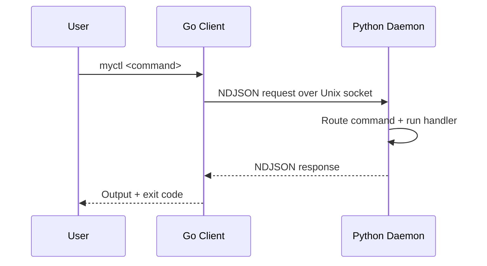

# Technical Overview

## Read This Section

Read these pages from top to bottom. Each page builds on the previous one and follows the same runtime path the daemon uses.

If a term appears before it is defined, the next page should explain it in context.

---

## How MyCTL Works in One Minute

MyCTL is a split system with three parts:

1. A thin Go client receives the command.
2. It sends the request over a Unix socket.
3. A persistent Python daemon routes and executes the command.
4. The daemon returns the response as NDJSON, one JSON object per line.

That is the basic data flow for every command in the system.



---

## How To Read This Section

Use the sidebar as the map. This page is the entry point and the reading order.

Each subsection explains one stage of the runtime path:

### Start Here

- **Core Runtime**: startup, bootstrapping, IPC, request context, and routing.
- **Plugin System**: discovery, loading, and lifecycle.
- **Quality & Governance**: the runtime tradeoffs and control boundaries that shape the system.

If you read the pages in that order, the rest of the technical section stays in the same flow as the actual system.


## Fast Sanity Commands

```bash
myctl status
myctl schema
myctl logs
```

- `status`: confirms daemon state
- `schema`: shows the registered command tree
- `logs`: helps diagnose plugin load and dispatch issues
