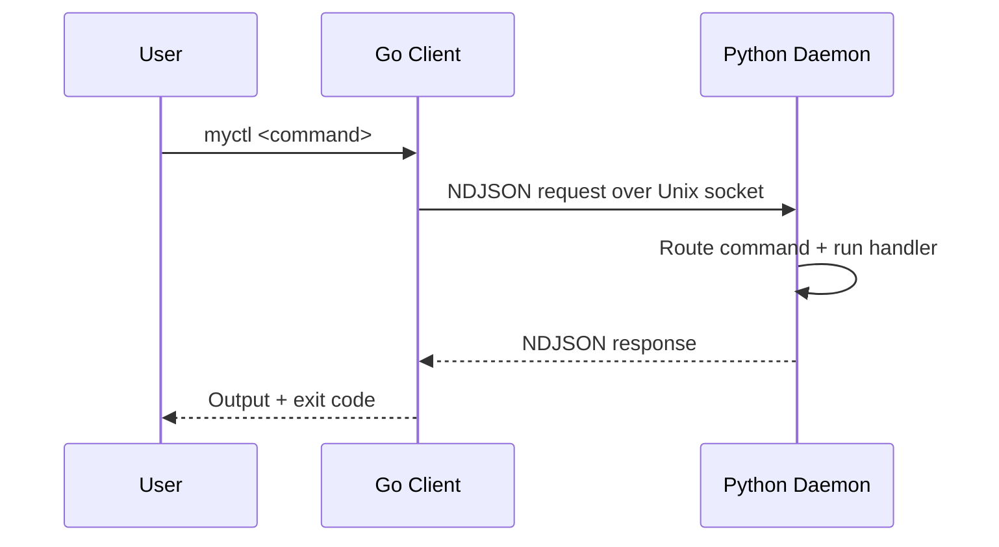

# Technical Overview

## Who This Section Is For

This technical section is for developers with beginner-to-mid Python/Go experience who want to understand how MyCTL works internally.

You do not need to know every low-level detail before contributing. Start with the pages below in order.

---

## How MyCTL Works in One Minute

MyCTL is a split system:

1. A thin Go client receives your command.
2. It sends the request over a Unix socket.
3. A persistent Python daemon routes and executes the command.
4. Response is returned as NDJSON.

This design keeps the CLI fast while allowing rich plugin behavior.



---

## Suggested Reading Order

### 1) Core Runtime

- [System Architecture](./architecture): End-to-end design and responsibilities.
- [Bootstrapping](./bootstrapping): How daemon startup and cold boot work.
- [IPC Protocol](./ipc-protocol): Request/response format and command transport.
- [Core Engine and Registry](./registry): How commands are stored and dispatched.

### 2) Plugin System

- [Plugin Loading](./plugin-loading): Namespaced loading model and import safety.
- [Plugin Discovery](./plugin-discovery): Tiered paths and plugin shadowing rules.
- [Plugin Lifecycle](./lifecycle): Load hooks, periodic tasks, and failure handling.

### 3) Quality and Governance

- [Performance Benchmarks](./benchmarks): Why the client is implemented in Go.
- [Permission Model (Planned)](./permissions): Planned security model, not implemented yet.


## Fast Sanity Commands

```bash
myctl status
myctl schema
myctl logs
```

- `status`: confirms daemon state
- `schema`: shows registered command tree
- `logs`: helps diagnose plugin load/dispatch issues
