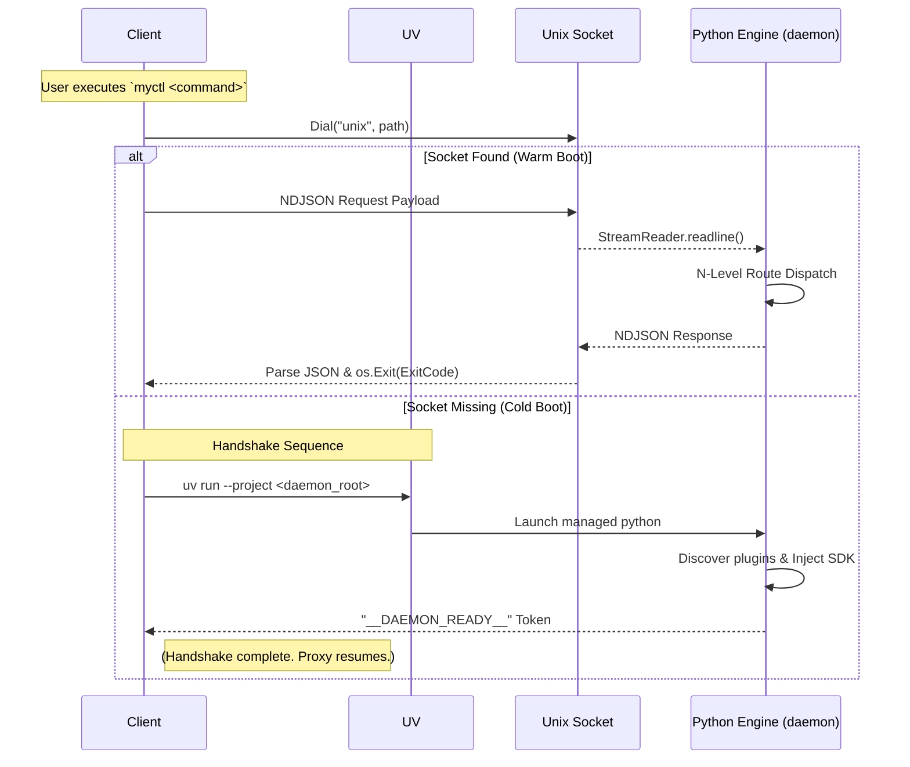

Welcome to the internal technical documentation for **{{metadata.title}}**. This section details the low-level architecture, protocols, and orchestration mechanisms that power the system.

## Who is this for?

This documentation grade is **Internal Strategy**. It is designed for:

- Contributors maintaining the **Client** or **Python Engine**.
- Architectural enthusiasts interested in **Lean Server-Thin Client Pattern**.

## 🔄 The Logic-Less Lifecycle

MyCTL subverts the traditional CLI model by separating the user interaction (Go Client) from the system logic (Python Engine). The interaction is completely governed by the status of the Unix Socket.

## 🏗 Technical Specifications

Explore the core components and low-level protocols that enable MyCTL's high-performance architecture.

| Specification                                 | Core Concern           | Focus Areas                                                          |
| :-------------------------------------------- | :--------------------- | :------------------------------------------------------------------- |
| **[Architecture](./architecture.md)**         | **The Managed Engine** | Proxy delegation, dynamic tree inflation, and zero-logic principles. |
| **[IPC Protocol](./ipc-protocol.md)**         | **Communication**      | NDJSON specification, socket paths, and system namespaces.           |
| **[Discovery Engine](./plugin-discovery.md)** | **The Registry**       | Tiered shadowing, implicit identity, and SDK bridge mechanics.       |
| **[Bootstrapping](./bootstrapping.md)**       | **Self-Management**    | UV-native orchestration, cold boot lifecycle, and SDK injection.     |
| **[Registry Core](./registry.md)**            | **N-Level Routing**    | Command tree construction and the recursive dispatch loop.           |
| **[Plugin Lifecycle](./lifecycle.md)**        | **Hooks & State**      | Periodic tasks, `on_load` initialization, and sandboxing.            |
| **[Permission Governance](./permissions.md)** | **The Sandbox**        | Capability manifest enforcement and namespace restrictions.          |
