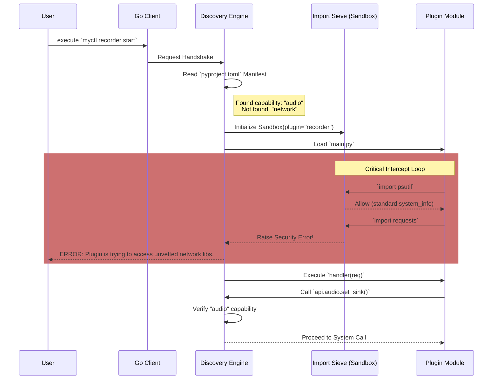

# Permissions: The Least-Privilege System

> [!WARNING] IN PLANNING
> The features described here are currently in the design phase and have not yet been implemented in the codebase.

The **Permission** engine is a security-first layer designed to ensure that MyCTL plugins operate within a strictly defined "Blast Radius."  
By moving from a fully trusted model to a **Capability-Based** and **Namespace-Restricted** model, MyCTL provides a robust platform for expansion while maintaining system integrity.

---

## 🏗 The Architecture of Enforcement

MyCTL implements security across three distinct layers, from the **Handshake Phase** to the **Runtime Execution loop**.

### 1. Declarative Capability Manifest

Every plugin MUST declare its required system capabilities in the `pyproject.toml` file. If a plugin attempts an action it hasn't declared (like controlling audio), the Core Engine will block the call and return a `SecurityViolation` error to the User.

```toml
# plugins/sysinfo/pyproject.toml

[tool.myctl.permissions]
allow = ["system_info", "notifications"]
deny = ["shell_exec", "network_access"] # Explicit denials (optional) (useless?)
```

### 2. Layer 1: Import Sieve (Namespace Sandboxing)

This is the **"Guard at the Gate"**. We prevent plugins from even "seeing" sensitive libraries by intercepting Python’s `import` statements at runtime.

#### The MetaPathFinder Mechanism

During the **Discovery Phase**, the MyCTL engine injects a custom `ImportFinder` into `sys.meta_path`. This finder acts as a "Sieve":

- **Safe Standard Library**: Always allowed (e.g., `json`, `math`, `re`, `datetime`, `collections`, `types`).
- **Internal SDK**: Always allowed (`myctl.api`, `myctl.core.ipc`).
- **Capability-Locked**: Only allowed if declared in `pyproject.toml` (e.g., `psutil` requires `system_info`).
- **Dangerous**: Always blocked (e.g., `ctypes`, `builtins.exec`, `builtins.eval`).

> [!NOTE]
> **Implementation Detail**: If a plugin tries to `import subprocess` without the `shell_exec` permission, the engine raises an **`ImportError`** with the message: _"Security Violation: Namespace 'subprocess' is unauthorized for this plugin's capability set."_

### 3. Layer 2: API Interception (Capability-Based SDK)

For system-native tasks (Audio, Power, Displays), the project provides official **MyCTL Standard APIs**. These are highly secure, audited wrappers that the Core Engine exposes via the SDK.

---

## 🔄 The Permission Handshake Lifecycle

This diagram demonstrates how a command is verified from the first cold boot to the plugin's execution.



---

## 🎨 Permission Genres & Capabilities

This table maps the **Permission Group** to the **Underlying Capabilities** it unlocks.

| Permission Genre | Standard APIs Allowed | External Libs Unlocked | User Risk Level              |
| :--------------- | :-------------------- | :--------------------- | :--------------------------- |
| `system_info`    | `api.sys`             | `psutil`               | **Low** (read-only)          |
| `notifications`  | `api.gui.notify`      | N/A                    | **Low**                      |
| `audio`          | `api.audio`           | `pulsectl`, `pipewire` | **Medium**                   |
| `network`        | `api.net`             | `requests`, `httpx`    | **High** (exfiltration risk) |
| `shell_exec`     | `api.sh`              | `subprocess`           | **CRITICAL** (full takeover) |


## ⚖️ User Consent & Overrides

To balance security with developer freedom, MyCTL implements a **Tiered Consent** model during the installation phase.

1.  **Implicit Trust**: Plugins that only use `system_info` or `notifications` are loaded silently.
2.  **Explicit Consent**: When a plugin requests **High** or **CRITICAL** permissions (like `network` or `shell_exec`), the CLI prompts the user once:
    > ⚠️ **Authorisation Required**: Plugin 'SuperTool' is asking for full **Shell Access**. This plugin can run any command on your computer.  
    > [ ] I trust this plugin (Allow always)  
    > [ ] Allow this once  
    > [ ] Deny and Abort  

3.  **The "Unvetted" Escape Hatch**: Developers can use any library they want by asking for `unvetted_imports: true`. This triggers a RED warning with a full list of third-party libraries we identified via static analysis.


## 🛠 Engineering Steps

1.  **Develop `MetaPathFinder`**: Build the core import-interceptor class in `myctl.core.sandbox`.
2.  **SDK Decorators**: Implement `@require_capability` for core API functions.
3.  **Static Analysis**: Use Python’s `ast` module to scan plugins for direct library imports before loading.
4.  **CLI Approval Loop**: Update the Go Client to handle "Permission Challenge" responses from the daemon.
