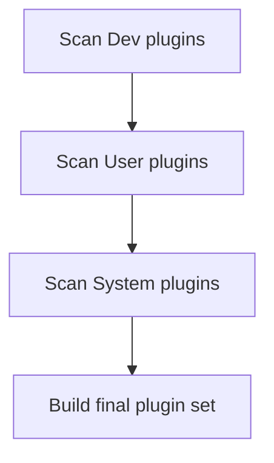
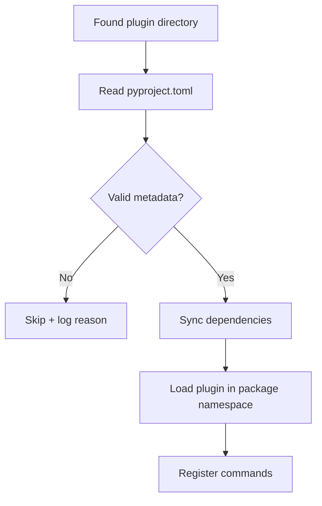

# Plugin Discovery

## Discovery Paths and Priority

MyCTL scans plugins in priority order:

1. Development path: project `plugins/`
2. User path: `$XDG_DATA_HOME/myctl/plugins`
3. System path: `/usr/share/myctl/plugins`

Earlier paths have higher priority.

## Shadowing Rule (Name Collision)

Plugin ID is the directory name.

If two plugins share the same ID, the higher-priority one wins and lower-priority ones are ignored.

Example:

- `plugins/audio/` (dev)
- `/usr/share/myctl/plugins/audio/` (system)

Result: dev `audio` is loaded, system `audio` is skipped.

This is intentional so local development overrides shipped defaults safely.

## Validation Before Load

Before importing plugin code, MyCTL validates each candidate:

1. Directory structure exists
2. `pyproject.toml` exists
3. `[project].name` matches folder name exactly
4. Declared API version is compatible

If validation fails, plugin is skipped and error is logged.

## Discovery + Load Pipeline

## Dependency Sync Behavior

If plugin declares dependencies in `pyproject.toml`, MyCTL syncs them through managed environment tooling before loading.

Important outcomes:

- Plugin dependencies are available at runtime
- Dependency failures do not crash the entire daemon
- Failed plugins are rejected while other plugins continue loading

## What Discovery Does Not Do

Discovery is responsible for finding and validating plugin candidates.

It does not:

- Parse IPC payloads
- Execute command dispatch logic
- Render CLI output

Those responsibilities belong to registry, IPC, and client layers.

## Quick Debug Checklist

If a plugin command is missing:

1. Confirm plugin folder is in one of discovery paths.
2. Confirm folder name matches `[project].name`.
3. Check daemon logs for validation or dependency errors.
4. Run `myctl schema` and verify plugin subtree exists.

