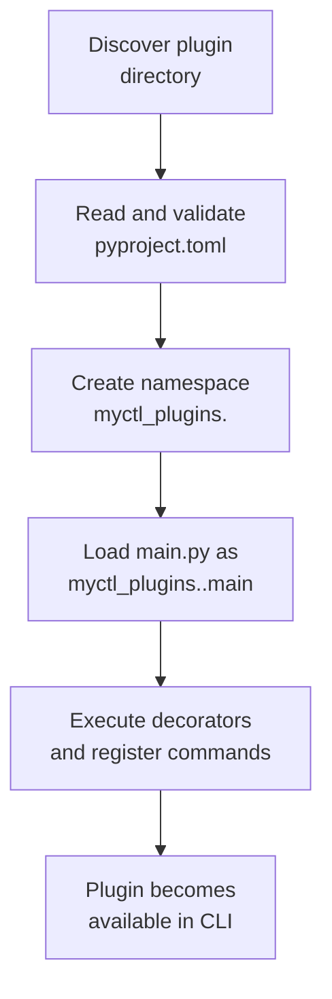

# Plugin Loading Architecture

## Who This Is For

This page is for developers who are comfortable with Python basics and async functions, but are newer to plugin systems.

If you can read `main.py`, understand imports, and use `myctl` commands, this page is the right level.

---

## What MyCTL Does Today

MyCTL loads plugins using **package-context loading**.

That means each plugin is loaded as its own Python package namespace, for example:

- `myctl_plugins.weather.main`
- `myctl_plugins.weather.src.service`
- `myctl_plugins.audio.main`

This avoids module name collisions and makes imports predictable.

---

## Why This Design Exists

### The Problem It Solves

Many plugins use common filenames like `service.py`, `utils.py`, or `handlers.py`.

Without namespaced loading, plugins can accidentally import each other's modules.

With package-context loading, each plugin gets an isolated import path:

- `myctl_plugins.weather.src.service`
- `myctl_plugins.stocks.src.service`

Both can exist at the same time with no conflict.

### Practical Benefits

- Reliable imports (no hidden cross-plugin collisions)
- Better IDE support for relative imports
- Easier debugging due to fully qualified module names
- Minimal startup overhead, no runtime overhead

---

## End-to-End Loading Flow



---

## Required Plugin Layout

Use this layout for every plugin:

```text
plugins/weather/
├── pyproject.toml
├── main.py
└── src/
    ├── __init__.py
    └── service.py
```

Rules:

- Directory name is the plugin ID (`weather`)
- `[project].name` in `pyproject.toml` must match directory name
- Keep `main.py` for registration only
- Put business logic in `src/`

---

## main.py vs src/

### main.py (Registration Layer)

`main.py` should register commands and call into implementation code.

```python
from myctl.api import Plugin, Context
from .src.service import fetch_weather

plugin = Plugin("weather")

@plugin.command(path="current", help="Get current weather")
async def cmd_current(ctx: Context):
    city = ctx.args[0] if ctx.args else "Kolkata"
    return ctx.ok(await fetch_weather(city))
```

### src/service.py (Implementation Layer)

`src/` modules should contain the actual logic.

```python
import httpx


async def fetch_weather(city: str) -> dict:
    async with httpx.AsyncClient() as client:
        resp = await client.get(f"https://wttr.in/{city}?format=j1", timeout=10.0)
        resp.raise_for_status()
    current = resp.json()["current_condition"][0]
    return {
        "city": city,
        "temp_c": current["temp_C"],
        "condition": current["weatherDesc"][0]["value"],
    }
```

---

## Import Rules You Should Follow

Use relative imports from `main.py`:

```python
from .src.service import fetch_weather
from .src.handlers import get_status
```

Avoid bare imports:

```python
from service import fetch_weather
```

Why: relative imports keep your plugin inside its own namespace and stay IDE-friendly.

---

## Lifecycle in Plain Terms

When the daemon starts or reloads plugins:

1. Find plugin directories from search paths
2. Validate plugin metadata
3. Sync dependencies from plugin `pyproject.toml`
4. Load `main.py` in plugin namespace
5. Register commands from decorators
6. Run optional lifecycle hooks (`on_load`, periodic tasks)

If any step fails, MyCTL logs the failure and continues loading other plugins.

---

## Performance Notes

- Loading overhead is tiny (milliseconds at startup)
- Runtime command execution is unchanged
- Memory increase is small because modules are shared; only namespace metadata is added per plugin

In short: the reliability gain is much bigger than the cost.

---

## Troubleshooting Checklist

### Plugin Command Not Showing

Check:

- Plugin folder is in a valid discovery path
- `pyproject.toml` exists
- `[project].name` equals the folder name exactly
- `main.py` imports are valid

### Import Errors in main.py

Check:

- You used relative imports (`.src...`)
- `src/__init__.py` exists
- Target functions are exported from the module

### Lint/IDE Complaints About Imports

Most often caused by bare imports. Switch to relative imports.

---

## Quick Verify Commands

```bash
myctl schema
myctl restart
myctl logs
```

- `schema`: confirms command registration
- `restart`: reloads daemon/plugin state
- `logs`: shows plugin load and runtime errors

---

## Related Docs

- [Plugin SDK Quick Start](../../dev/plugin-sdk/quick-start.md)
- [Commands and Flags](../../dev/plugin-sdk/adding-commands.md)
- [Plugin Lifecycle](./lifecycle.md)

