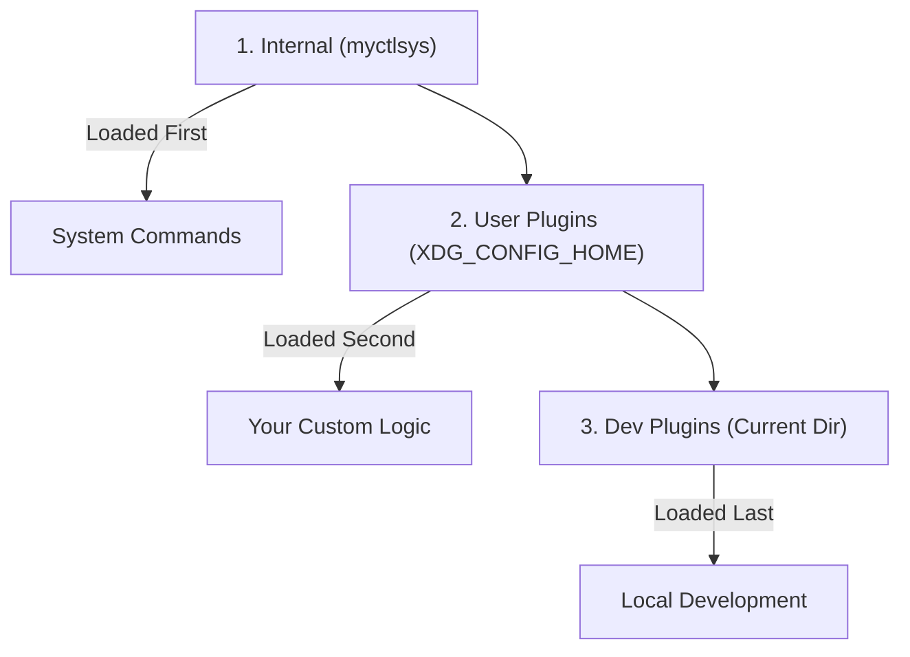

# Plugin Discovery

This page explains how the MyCTL Engine (`myctld`) finds your plugins on disk and decides which ones to load.

## 1. What Is A Plugin Folder?

A folder must have exactly these two things to be a candidate for a plugin:

| File                 |        Role         | Sample Path                      |
| :------------------- | :-----------------: | :------------------------------- |
| **`pyproject.toml`** | Metadata (Identity) | `plugins/weather/pyproject.toml` |
| **`main.py`**        | Entry Point (Code)  | `plugins/weather/main.py`        |

---

## 2. Search Tiers (Precedence)

The Engine scans three main locations ("tiers") for plugins. If two plugins have the same name, **the one in the higher tier wins**.

### Tier Priority

1.  **Internal**: System features (status, stop). These are built into the daemon and cannot be deleted.
2.  **User**: Standard plugins installed by the user (usually in `{{ metadata.paths.plugins }}`).
3.  **Development**: Plugins in the current working directory, used for local testing.

---

## 3. The Discovery Algorithm

The `PluginManager` (in `daemon/myctld/plugins/manager.py`) follows these steps:

1.  **Iterate Paths**: Loop through each configured search path.
2.  **Validate Directory**: Check if the folder has a `pyproject.toml`.
3.  **Check Identity**: Read the `[project].name` from the manifest.
    - **CRITICAL RULE**: The name in `pyproject.toml` MUST match the directory name.
4.  **Deduplicate**: If the plugin ID is already loaded from a higher-priority path, skip it.
5.  **Versioning Gate**: The `PluginLoader` checks the `api_version` in the manifest.
    - **Strict Major Matching**: The plugin's major version must match the Engine's (e.g., a `3.1.0` plugin is compatible with a `3.0.0` Engine, but a `2.0.0` plugin is rejected).
6.  **Initialize**: Pass the directory to the `PluginLoader` to finish the import.

---

## 4. Key Implementation Details

- **File**: `daemon/myctld/plugins/manager.py`
- **Method**: `PluginManager.discover()`
- **Security**: The Engine will log a warning but keep running if a single plugin fails to load. This ensures one "stale" plugin doesn't break your entire CLI.
- **Performance**: Discovery only happens once at startup (and potentially on manual reload). It's designed to be fast by only checking for the presence of two required files before attempting a full Python import.
