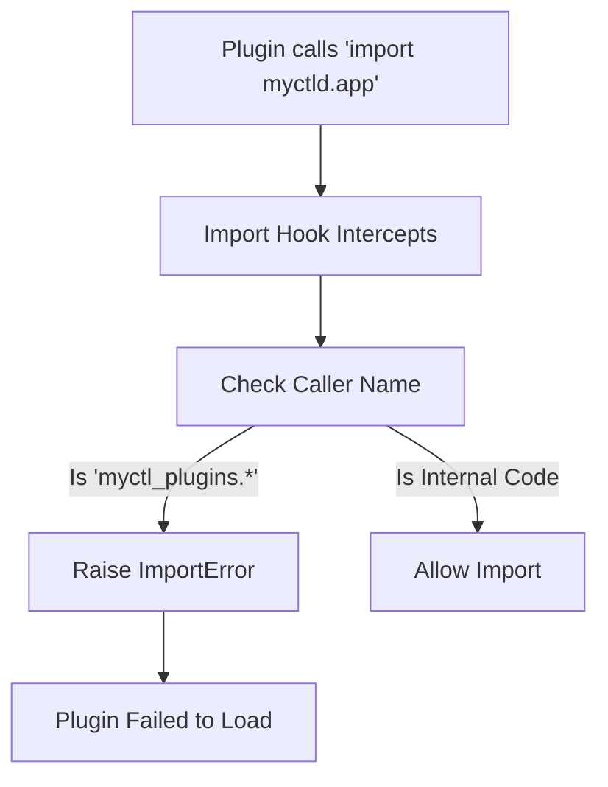

# Plugin Security & Isolation

The MyCTL Engine is designed to load third-party code securely. We use two primary mechanisms to ensure a plugin can't break the Engine or other plugins: **Namespace Namespacing** and the **Runtime Import Guard**.

## 1. Namespace Isolation

When a plugin is loaded, it is not imported into the Global Python namespace. Instead, it is isolated in a unique "Package Root."

### The Logic
Each plugin lives under `myctl_plugins.<plugin_id>`. This means:
*   `plugins/weather/main.py` -> `myctl_plugins.weather.main`
*   `plugins/audio/main.py` -> `myctl_plugins.audio.main`

### Why?
This prevents **Naming Collisions**. If two plugins both have a file named `utils.py`, they won't conflict because they are in different namespaces.

---

## 2. The Runtime Import Guard

This is the most critical security feature in MyCTL. It prevents a plugin from "bypassing" the SDK to touch the Engine's internal code.

### The Problem
Since both `myctld` (Engine) and `myctl` (SDK) are in the same Python process, a malicious (or curious) plugin might try to `import myctld.app` and call internal functions.

### The Solution: `_MyCTLDImportGuard`
The Engine installs a custom **Import Hook** (in `sys.meta_path`). 

### Protocol Steps:
1.  **Intercept**: The hook catches any import starting with `myctld`.
2.  **Inspect**: It walks up the call stack (using `inspect.stack()`) to find the module doing the import.
3.  **Identify**: If the importer’s name starts with `myctl_plugins.`, it concludes that a plugin is trying to access protected internals.
4.  **Harden**: It raises an **`ImportError`**, which causes the Plugin Loader to reject that plugin and move on.

---

## 3. Dependency Sandboxing

If a plugin has a `pyproject.toml` with dependencies, the **Plugin Manager** runs `uv sync` specifically for that plugin folder. This ensures the plugin has its required libraries available without polluting the Engine's global environment.

---

## 4. Key Implementation Details

*   **File**: `daemon/myctld/__init__.py`
*   **Class**: `_MyCTLDImportGuard`
*   **No Bypass**: There are no "escape hatches" in user-facing mode. The boundary between the Engine and the Plugins is absolute to ensure stability and security.
