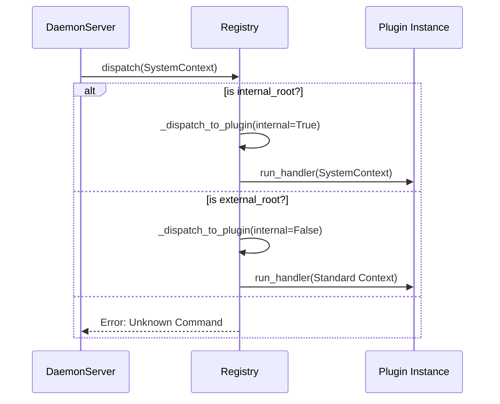

# Command Routing & Dispatch

This page explains how the MyCTL Engine (`myctld`) takes a request path (e.g., `["volume", "set"]`) and finds the right Python function to run.

## 1. Unified Dispatch Strategy

In this architecture, we treat **everything** as a command. However, we maintain a strict **Priority Hierarchy** to ensure system stability and security.

### Priority Level 1: Internal Plugins (Privileged)
Internal plugins (like `status`, `stop`, `plugin`) are loaded from the Engine's own source tree. They have **First Priority** in the routing table and are allowed to receive a `SystemContext`.

### Priority Level 2: External Plugins (Isolated)
User-installed plugins search paths are checked only if no internal command matches the root path. These handlers are strictly isolated.

---

## 2. Dispatch Flow

When a request arrives, the `Registry` (in `daemon/myctld/registry.py`) follows this lifecycle:



### Context "Downcasting"
To ensure security, the Engine always starts with a `SystemContext`. If the command is routed to an **External Plugin**, the Registry "downcasts" the context to a standard SDK `Context`, stripping away privileged methods like `request_shutdown`.

---

## 3. Subcommand Matching Algorithm

Plugins in MyCTL can have complex, nested command structures (e.g., `myctl volume set level 50`). The Engine uses a **Longest-Prefix Match** algorithm to resolve these paths.

```python
# daemon/myctld/registry.py
# Match subcommand path
sub_path = ctx.path[1:] # Strip the plugin root
best_match = None

for handler in getattr(loaded.plugin, "_commands", []):
    meta = getattr(handler, "__myctl_cmd__", {})
    cmd_path = str(meta.get("path", "")).split()
    
    # Check if the requested sub_path starts with this command's path
    if sub_path[: len(cmd_path)] == cmd_path:
        # Longest prefix wins (e.g. 'set level' over just 'set')
        if best_match is None or len(cmd_path) > best_match[0]:
            best_match = (len(cmd_path), handler, meta)
```

---

## 4. Key Implementation Details

*   **Registry Separation**:
    - `self.internal_plugins`: Map of privileged system handlers.
    - `self.plugins`: Map of isolated user plugins.
*   **Shadowing Prevention**: Because `internal_plugins` are checked first, an external plugin can never "shadow" (hijack) a system command like `stop`.
*   **Performance**: The root-path lookup is `O(1)`. The subcommand search is linear within a single plugin, which is extremely fast even for large plugins.
