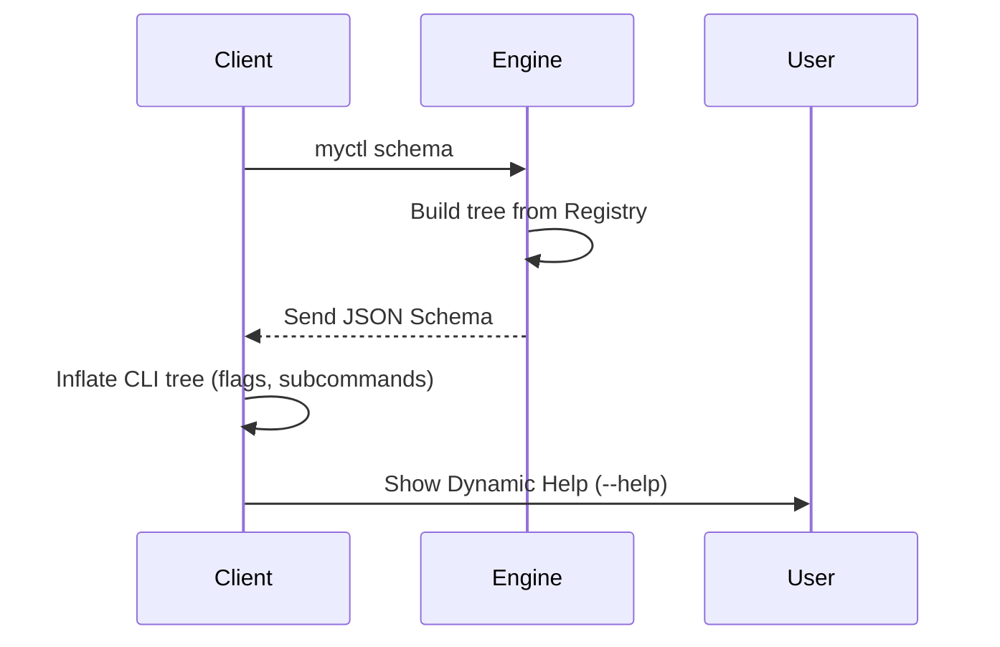

# Command Schema & Tree Inflation

This page explains how the Go Client knows what commands are available in the Python Engine without having to look at the plugin source code.

## 1. Schema Syncing

When the Go Client starts up, it asks the Engine for a "Blueprint" of the entire command tree. This contains every command name, help string, and flag.



---

## 2. The `CommandNode` Structure

The schema is a recursive dictionary (a tree). Each "Node" represents a command or a subcommand.

### Schema Fields

| Field | Type | Description |
| :--- | :---: | :--- |
| **`name`** | `str` | Name of the command (e.g., `status`). |
| **`help`** | `str` | Short description for `--help`. |
| **`flags`** | `list` | All flags available for this command. |
| **`children`** | `dict` | Nested subcommands. |

### Example Schema
```json
{
  "status": {
    "help": "Show daemon status",
    "flags": []
  },
  "volume": {
    "help": "Audio control",
    "children": {
      "set": {
        "help": "Set volume level",
        "flags": [{"name": "--mute", "short": "-m", "help": "Mute audio"}]
      }
    }
  }
}
```

---

## 3. Dynamic Flag Mapping

When a command is registered with `@plugin.flag`, the Engine automatically adds it to the schema.

### Flag Mapping Table:

| Engine Flag (`@plugin.flag`) | Client CLI Result |
| :--- | :--- |
| `name="mute"` | `--mute` |
| `short="m"` | `-m` |
| `flag_type=int` | Argument requires a number |
| `required=True` | CLI will error if flag is missing |

---

## 4. Key Implementation Details

*   **File**: `daemon/myctld/schema.py`
*   **Tree Inflation**: The Go client doesn't "hardcode" any plugin paths. It simple iterates the JSON tree from the Engine and maps it to a CLI framework (like Cobra or a custom one).
*   **Lazy Loading**: The schema is only sent once per session. The Client caches it, but only if the Engine signals that nothing has changed.
