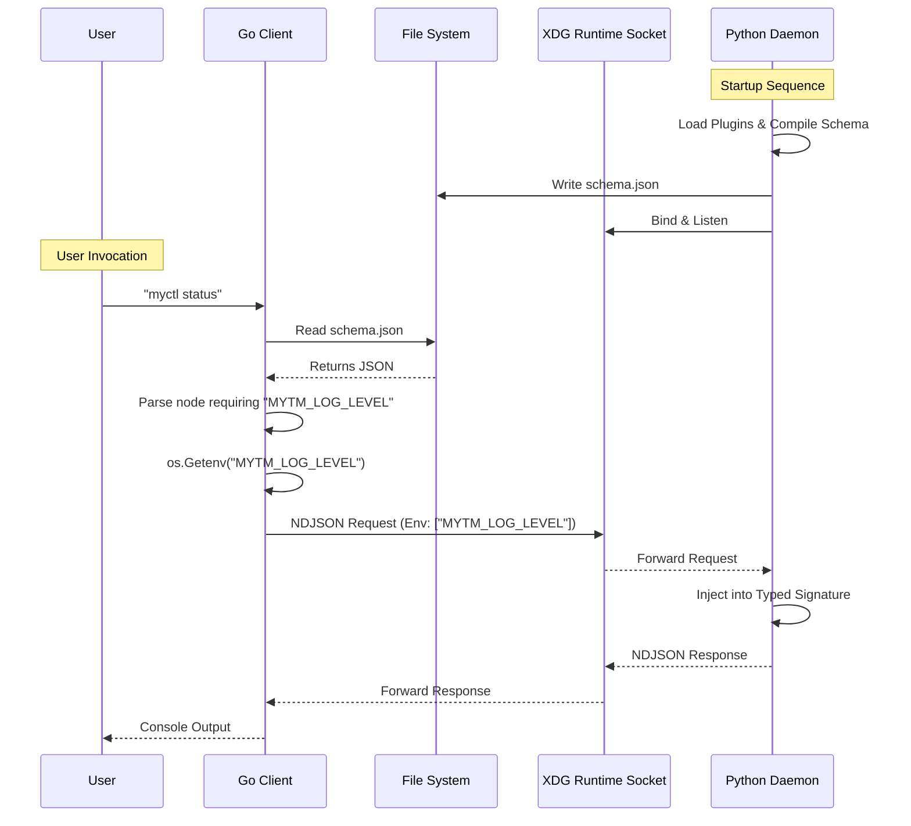

# Architectural Plan: High-Performance Schema Caching & Declarative Environments

> [!WARNING]
> **DRAFT / PLAN**: This page acts as the definitive architectural blueprint for upcoming codebase changes. The implementation is currently pending.

## 1. Executive Summary

MyCTL relies on a Lean Client / Fat Server architecture. While the Go Client (`cmd/main.go`) operates with sub-millisecond precision, we have identified two structural inefficiencies within the Command Discovery and Context Construction phases:

1. **IPC Routing Overhead**: The Go Client currently queries the Python Engine over a Unix socket (`["schema"]`) on every invocation just to understand the command tree. Since the CLI structure is static while the daemon runs, this IPC round-trip is pure overhead.
2. **Context Security & Bloat**: To provide plugin handlers with the user's shell context, the client would normally need to transmit `os.Environ()`. Blindly shipping the entire shell environment over an IPC socket exposes sensitive keys (e.g., `AWS_ACCESS_KEY_ID`) and creates unnecessary payload bloat.

This blueprint establishes **File-Based Schema Caching** and **Declarative Environment Injection** to solve both issues elegantly, ensuring a zero-overhead CLI with zero-trust environment scoping.

---

## 2. File-Based Schema Caching

Instead of the Client traversing a socket to discover commands, the Engine will proactively push the boundary to disk.

### 2.1 The Engine (Writer)

When `myctld` starts and successfully progresses through the **Hook Execution Phase** (bootstrapping internal and external plugins), it compiles the final definitive `CommandNode` tree.

Instead of just holding it in memory, the `Registry` will securely dump this structure:
- **Location**: `$XDG_RUNTIME_DIR/myctl/schema.json`
- **Timing**: Written exactly once per Daemon lifecycle (after successful plugin loading).
- **Semantics**: If this file exists and is accessible, the Daemon is fully active and the schema is absolute truth.

### 2.2 The Client (Reader)

The Go Client (`cmd/main.go`) will abandon the `fetchSchema()` network call during standard execution.

1. Client attempts `os.ReadFile` on `$XDG_RUNTIME_DIR/myctl/schema.json`.
2. If successful, the JSON is inflated directly into the Cobra command tree with zero blocking I/O overhead.
3. If the file is missing or corrupt, the Client triggers the `BootstrapDaemon()` cold-boot sequence.

---

## 3. Declarative Environment Injection

We must protect sensitive user shell variables from untrusted external plugins without destroying the Developer Experience needed by tools that legitimately depend on shell context (e.g., a process manager needing `MYTM_LOG_LEVEL`).

### 3.1 The SDK (`myctl.plugin`)

Plugin developers will explicitly declare their environment dependencies using typed Python signatures, identical to how they declare `flag()`.

```python
from myctl import Plugin, Context, env

plugin = Plugin()

@plugin.command("status")
async def status(ctx: Context, log_level: str = env("MYTM_LOG_LEVEL", default="info")):
    return ctx.ok(f"Log Level: {log_level}")
```

### 3.2 Schema Encoding

When the Engine's `_parse_signature` reflection runs, it identifies these `env` markers. Rather than resolving them on the server side (which only sees the daemon's stale environment), it encodes the requirement into the `$XDG_RUNTIME_DIR` schema manifest:

```json
{
  "status": {
    "type": "command",
    "help": "",
    "env_vars": ["MYTM_LOG_LEVEL"]
  }
}
```

### 3.3 The Lean Context Pipeline (Go Client)

When the user invokes `myctl status`:

1. The Go Client inflates the cached schema.
2. It routes the command and inspects the Node's `env_vars` requirement array.
3. The Client performs a highly restricted `os.Getenv("MYTM_LOG_LEVEL")`.
4. The constructed NDJSON `Request.Env` map **only contains precisely requested variables**. Sensitive secrets remain isolated in the host shell.

This guarantees a **Zero-Trust IPC Boundary** while fulfilling every explicit plugin dependency.

---

## 4. Execution Sequence Diagram



## 5. Security & Fallback Rules

- **Client Fallback**: If the Client receives an IPC connection error despite the presence of `schema.json`, it must delete the stale schema cache and trigger a cold boot.
- **Engine Safety**: The Engine must delete `schema.json` upon graceful shutdown via `atexit` or `SIGINT` trapping to prevent stale client configurations.
- **Environment Inference**: Like Flags, `env()` declarations without a `default` are considered **Required**. If the shell variable is absent, the Go Client should fail fast before transmitting over the IPC domain.
